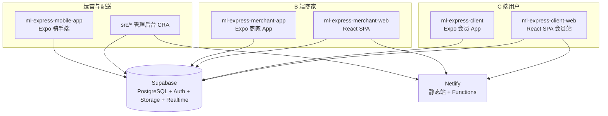

# MARKET LINK EXPRESS — AI 与维护者架构指南

本文档概括本仓库（**market-link-express / ml-express**）内所有面向用户与管理的产品形态、目录职责、路由与部署关系，便于后续改需求时不混淆边界。

---

## 1. 仓库总览

本仓库是 **多包单体仓库（monorepo）**：根目录即 **管理后台 Web**；其余业务线为子目录独立应用，**各自**依赖 Supabase、各自动 Netlify / 应用商店发布。

---

## 2. 子项目一览

| 目录 | 类型 | 角色 | 技术栈 |
|------|------|------|--------|
| **`/`（仓库根）** | Web | **管理后台**：订单、用户、财务、跟踪、告警、账号权限、报表、骑手绩效、商家对账导出等 | Create React App + TypeScript + React Router v6 |
| **`ml-express-client-web/`** | Web | **会员端网站**：首页（含内嵌服务/追踪/联系板块）、商城、购物车、账户、条款 | CRA + TS + React Router v7 |
| **`ml-express-merchant-web/`** | Web | **商家端网站**：登录后门店订单/商品等（与商家 App 业务对齐） | CRA + TS + React Router v7 |
| **`ml-express-client/`** | Mobile | **会员 App**（MARKET LINK EXPRESS） | Expo / React Native |
| **`ml-express-merchant-app/`** | Mobile | **商家 App** | Expo / React Native |
| **`ml-express-mobile-app/`** | Mobile | **骑手/配送员端**（package 名 `market-link-express-mobile`） | Expo / React Native |
| **`design/`** | 资源 | 应用图标等设计资产 | — |
| **`specs/`** | 文档 | 功能规格/通知等说明 | — |

**说明**：根目录 `package.json` 的 `name` 为 `market-link-express`，与 C 端站点品牌一致，但 **代码职责是管理后台**，部署时不要与 `ml-express-client-web` 站点混用 Base directory。

---

## 3. 管理后台（仓库根 `src/`）

### 3.1 入口与路由

- 入口：`src/index.tsx` → `src/App.tsx`
- 根路径 `/` 重定向到 **`/admin/login`**
- 受保护区域：`**`/admin/*`**`，外层 `AdminShellLayout`（侧栏 + 顶栏），内层 `ProtectedRoute` 按 **角色**（`admin` | `manager` | `operator` | `finance`）与可选 **permissionId** 控制菜单与页面

主要路径（节选，以 `src/App.tsx` 为准）：

| 路径 | 权限要点 |
|------|----------|
| `/admin/login` | 登录 |
| `/admin/dashboard` | 仪表盘 |
| `/admin/city-packages` | `city_packages` |
| `/admin/users` | `users` |
| `/admin/finance` | `finance` |
| `/admin/tracking`、`/admin/realtime-tracking` | `tracking` |
| `/admin/settings`、`/admin/system-settings` | `settings`（多 admin） |
| `/admin/accounts` | 账号与权限 |
| `/admin/banners` | 轮播 |
| `/admin/delivery-stores` | 送达店铺/商家 |
| `/admin/supervision`、`/admin/audit-logs` | 督导/审计 |
| `/admin/delivery-alerts` | 配送警报 |
| `/admin/recharges` | 充值审核 |
| `/admin/reports` | 报表 |
| `/admin/courier-performance` | 骑手绩效 |
| `/admin/merchant-reconciliation` | 商家对账导出 |

全局组件：`AdminGlobalSearch`、`AdminTodoBar`、`AdminTodoProvider`、`AbnormalAlertManager` 等。

### 3.2 服务端能力

- Netlify：`netlify.toml` 在**仓库根**；`netlify/functions/` 提供邮件/短信等（与 Dashboard 环境变量配合）
- 默认生产部署站点 ID（`package.json` **`deploy:netlify`**）：`ed9c2173-4031-4f10-a466-5b041dfe3511`（以你 Netlify 控制台为准）

### 3.3 核心数据层

- `src/services/supabase.ts`：后台主要 API 封装（与 RLS、表名强相关；改表结构需同步此处）

---

## 4. 会员端网站 `ml-express-client-web/`

### 4.1 职责

- 仅服务 **会员**（`localStorage` **`ml-express-customer`**）；若检测到 `user_type === 'merchant'` 会清空并刷新，避免与商家端混淆（见 `App.tsx` 内 `ClientWebMerchantSessionGuard`）。

### 4.2 路由（`src/App.tsx`）

| 路径 | 行为 |
|------|------|
| `/` | `HomePage`（首页 + 内嵌 `#landing-services` / `#landing-tracking` / `#landing-contact`，见 `HomePage.tsx`） |
| `/services`、`/tracking`、`/contact` | `Navigate` 回 `/` 并带 `state.landingScrollTo`，滚动到对应锚点 |
| `/login` | 回 `/` |
| `/profile`、`/mall`、`/mall/:storeId`、`/cart` 等 | 独立懒加载页面 |
| `/privacy-policy`、`/terms-of-service` | 法律页 |

### 4.3 UI 结构

- **着陆区**：`HomePage` + `styles/homeLanding.css`；内页区块外壳：`components/layout/ClientInteriorShell.tsx` + `styles/clientInterior.css`
- Netlify：`ml-express-client-web/netlify.toml`；Functions：`ml-express-client-web/netlify/functions/`
- 生产部署站点 ID（`package.json`）：`52f5f573-ca0a-4769-a8c7-e5f675764056`

### 4.4 数据层

- `src/services/supabase.ts`、`LanguageContext`、`CartContext`

---

## 5. 商家端网站 `ml-express-merchant-web/`

- CRA + React Router，路由入口 `src/App.tsx`（`/login`、`/`、`/products`、`/orders` 等）
- Supabase：`src/services/supabase.ts`（与后台/会员库同一 Supabase 项目，表权限由 RLS 区分角色）
- Netlify：`ml-express-merchant-web/netlify.toml`；站点 ID：`126af2b9-244f-47fd-9be9-58fb45b6e7a2`

---

## 6. 移动端应用

### 6.1 `ml-express-client/`（会员 Expo）

- `app.json`：`com.mlexpress.client`，品牌 MARKET LINK EXPRESS
- `services/supabase.ts` + 多 screens；可选用 `netlify.toml` 做 Web 导出版本相关配置

### 6.2 `ml-express-merchant-app/`（商家 Expo）

- 与商家 Web 业务对齐；`src/services/supabase.ts` 体量较大（订单/商品/店铺等）

### 6.3 `ml-express-mobile-app/`（骑手 Expo）

- `package.json` 描述为骑手端；含地图、任务、定位等
- `services/supabase.ts` 与配送状态常量等

**共性**：环境变量多为 `EXPO_PUBLIC_*` 或项目内约定常量，需与 Supabase 项目 URL/anon key 一致；**不要**假设与 CRA 的 `REACT_APP_*` 自动互通。

---

## 7. Supabase 与数据模型（跨项目）

- 所有前后端应用共享 **同一 Supabase 项目**（由各自 env 指向）
- 业务表举例（非 exhaustive）：`packages`、`users`、`delivery_stores`、`couriers`、`delivery_alerts`、`recharge_requests`、`system_settings` 等
- **注意**：`couriers` 等表若缺列（如历史代码引用 `credit_score`），PostgREST 会对非法 `select` 返回 **400**，需与真实 schema 对齐
- 各子项目内 **`supabase.ts` 多份拷贝** — 改接口时需考虑是否需同步改多处（或后续可抽共享包，当前以仓库现状为准）

---

## 8. Netlify 部署约定

| 应用 | 配置文件路径 | 典型 Base directory |
|------|----------------|---------------------|
| 管理后台 | `/netlify.toml` | **仓库根** |
| 会员 Web | `ml-express-client-web/netlify.toml` | `ml-express-client-web` |
| 商家 Web | `ml-express-merchant-web/netlify.toml` | `ml-express-merchant-web` |

Functions、重定向（如 SPA `/*` → `/index.html`）、缓存头以各自 `netlify.toml` 为准。

**自定义域名**：DNS 仅需指向 **一个** 生产站点；避免同一主机名同时 CNAME 到多个 `*.netlify.app` 或混用冲突记录，否则会出现部分网络「找不到服务器」或证书异常。

---

## 9. 环境变量（常见模式）

- **CRA**：`REACT_APP_SUPABASE_URL`、`REACT_APP_SUPABASE_ANON_KEY`、`REACT_APP_GOOGLE_MAPS_API_KEY`（若用地图）、各类 `REACT_APP_*_URL`（应用商店链接等）
- **Expo**：按子项目文档使用 `EXPO_PUBLIC_*` 或 `app.config` 注入
- **Netlify Functions**：密钥在 Netlify Dashboard，勿提交私钥

会员 Web 中邮件相关：`REACT_APP_EMAIL_FUNCTION_URL` 可选覆盖默认 `/.netlify/functions/send-email-code`。

---

## 10. 给后续改代码的提示（AI / 人本）

1. **改路由**：先确认是根目录 `src/`（后台）还是 `ml-express-client-web/src/`（会员站），二者 Router 版本与路径前缀均不同。  
2. **改权限**：后台新页面需同时改 `ProtectedRoute`、`AccountManagement` 内权限列表、以及 `AdminShellLayout` 菜单（若有）。  
3. **改 C 端着陆页块**：`HomePage` 内嵌 `ServicesPage` / `TrackingPage` / `ContactPage` 的 `embedInLanding` 模式不再重复导航栏。  
4. **不要用硬编码生产域名**拼接静态资源或 API，优先 **相对路径** 或 `window.location.origin`，避免 DNS 未就绪时开发/预览异常。  
5. **Deploy Preview** 的 `https://{deploy-id}--site.netlify.app` 会随部署失效，文档/测试应用 **正式域名** 或 **主站点 netlify.app**。

---

## 11. 版本与同步

- 根 `package.json`：`market-link-express` `2.2.4`（管理后台）
- 各子目录另有独立 `version`，发布流程相互独立

若本指南与代码不一致，**以当前仓库文件为准**，并建议更新本 `AI_GUIDE.md`。

---

*最后更新：基于仓库结构梳理，供 AI 与维护者快速建立上下文。*
