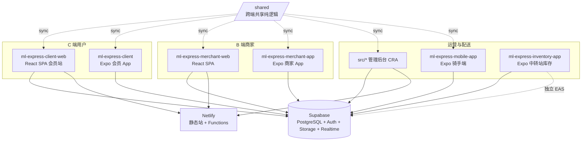
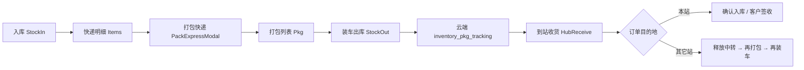

# MARKET LINK EXPRESS — AI 与维护者架构指南

本文档概括本仓库（**market-link-express / ml-express**）内所有产品形态、目录职责、数据边界、关键业务流程与部署关系，便于后续改需求或让 AI 快速建立上下文。**若本指南与代码不一致，以仓库当前文件为准，并请同步更新本文件。**

---

## 目录

1. [仓库总览](#1-仓库总览)
2. [生产域名与部署矩阵](#2-生产域名与部署矩阵)
3. [子项目一览](#3-子项目一览)
4. [管理后台（仓库根 `src/`）](#4-管理后台仓库根-src)
5. [会员端网站 `ml-express-client-web`](#5-会员端网站-ml-express-client-web)
6. [商家端网站 `ml-express-merchant-web`](#6-商家端网站-ml-express-merchant-web)
7. [移动端应用（Expo）](#7-移动端应用expo-sdk-54)
8. [Inventory 中转站 App `ml-express-inventory-app`](#8-inventory-中转站-app-ml-express-inventory-app)
9. [Admin 跨境物流控制台](#9-admin-跨境物流控制台)
10. [中转物流业务流（MUSE → MDY → YGN）](#10-中转物流业务流muse--mdy--ygn)
11. [共享代码层 `/shared`](#11-共享代码层-shared)
12. [Supabase 与数据模型](#12-supabase-与数据模型)
13. [Netlify 与 EAS 部署](#13-netlify-与-eas-部署)
14. [环境变量](#14-环境变量)
15. [给 AI / 维护者的改代码提示](#15-给-ai--维护者的改代码提示)
16. [常用文件速查](#16-常用文件速查)
17. [版本与分支](#17-版本与分支)

---

## 1. 仓库总览

本仓库是 **多包单体仓库（monorepo）**，但 **没有 npm workspaces**：根目录即 **管理后台 Web**；其余业务线为子目录独立应用，**各自**依赖 Supabase、各自独立部署（Netlify 静态站 / EAS 应用）。



**两条业务线（勿混表）：**

| 业务线 | 典型表 | 典型 App / 模块 |
|--------|--------|-----------------|
| **City 配送 / 商城 / 跑腿** | `packages`、`orders`、`products`、`couriers`… | 会员/商家/骑手 App + 管理后台 City 模块 |
| **中转站库存 / 跨境包裹** | `inventory_*`、`cross_border_manual_entries` | `ml-express-inventory-app` + Admin **跨境物流** |

**认证体系概览：**

| 端 | 登录方式 | 会话存储 |
|----|----------|----------|
| 会员 Web/App | Supabase Auth / 本地 customer | `localStorage` `ml-express-customer` |
| 商家 Web/App | Supabase Auth | 商家会话 |
| 骑手 App | Supabase Auth + `ensure-courier-auth` | SecureStore |
| 管理后台 | `verify-admin` Netlify Function + Cookie | Admin session |
| Inventory App | `inventory-store-login` Edge Function → JWT | SecureStore + Supabase Auth |

---

## 2. 生产域名与部署矩阵

| 产品 | 典型域名 / 渠道 | 说明 |
|------|-----------------|------|
| 会员 Web | `market-link-express.com` | `ml-express-client-web` Netlify |
| 管理后台 | `admin-market-link-express.netlify.app` 或自定义 admin 域 | 仓库根 CRA + Functions |
| 商家 Web | 独立 Netlify 站点 | `ml-express-merchant-web` |
| Inventory App Support | `https://market-link-express.com/support` | App Store Support URL |
| Inventory iOS | App Store `com.mlexpress.inventory` | EAS Build，当前 **1.2.0 (6)** |
| Supabase | `uopkyuluxnrewvlmutam.supabase.co` | 全端共用同一项目 |

> ⚠️ 勿在 App Store 使用无效域名（如 `linkexpress.com/support`）；Support URL 必须可访问。

---

## 3. 子项目一览

| 目录 | 类型 | 角色 | 技术栈 | 部署 |
|------|------|------|--------|------|
| **`/`（仓库根）** | Web | **管理后台**：订单、用户、财务、跟踪、告警、合伙店铺、报表等 | CRA + TS + React Router **v6** | Netlify（根目录） |
| **`ml-express-client-web/`** | Web | **会员端网站**：首页、商城、购物车、账户 | CRA + TS + React Router **v7** | Netlify |
| **`ml-express-merchant-web/`** | Web | **商家端网站**：门店订单/商品/对账 | CRA + TS + React Router **v7** | Netlify |
| **`ml-express-client/`** | Mobile | **会员 App**（`com.mlexpress.client`） | Expo SDK 54 / RN | EAS |
| **`ml-express-merchant-app/`** | Mobile | **商家 App** | Expo SDK 54 / RN | EAS |
| **`ml-express-mobile-app/`** | Mobile | **骑手端**（`market-link-express-mobile`） | Expo SDK 54 / RN | EAS |
| **`ml-express-inventory-app/`** | Mobile | **中转站库存 App**（ML Inventory）：入库、打包、装车、到站收货、快递明细 | Expo SDK 54 / RN + **SQLite 本地缓存** | EAS（独立包名） |
| **`shared/`** | 共享源 | 跨端纯逻辑单一源（计费/商品审核/充值 QR） | TS | sync 进各 app |
| **`netlify/`** | 服务端 | 管理后台 Netlify Functions | Node | — |
| **`supabase/`** | 数据 | SQL migrations + Edge Functions | SQL / Deno | Supabase Cloud |
| **`design/` `specs/` `scripts/` `docs/`** | 资源 | 设计、规格、CI 脚本、归档文档 | — | — |

> 根 `package.json` 的 `name` 为 `market-link-express`，**代码职责是管理后台**；勿与 `ml-express-client-web` 站点混用 Base directory。

> 历史排障文档已归档至 `docs/archive/`；构建产物（apk/aab/zip）不入库（见 `.gitignore`）。

---

## 4. 管理后台（仓库根 `src/`）

### 4.1 目录结构

| 路径 | 职责 |
|------|------|
| `src/index.tsx` → `src/App.tsx` | 入口与路由表 |
| `src/pages/` | 页面（见 §4.2） |
| `src/components/` | 通用与跨境组件（`CrossBorder*`、`CblTablePagination`） |
| `src/layouts/AdminShellLayout.tsx` | 侧栏+顶栏；`STANDALONE_ADMIN_MODULE_PATHS` |
| `src/contexts/` | 含 `AdminTodoContext` |
| `src/services/inventoryConsoleService.ts` | 跨境 Admin API 客户端 |
| `src/utils/crossBorderHubs.ts` | MUSE/MDY/YGN 枢纽与账号草稿 |
| `src/styles/crossBorderLogistics.css` | 跨境独立页样式 |
| `src/services/_shared/` | `/shared` 同步副本（**勿手改**） |
| `netlify/functions/` | 服务端（§4.6） |

### 4.2 路由与页面（`src/App.tsx`）

根 `/` → `/admin/login`；`**/admin/**` + `ProtectedRoute`（角色 + `permissionId`）。

| 路径 | 页面 | 权限 |
|------|------|------|
| `/admin/login` | `AdminLogin` | — |
| `/admin/dashboard` | 仪表盘 | 默认 |
| `/admin/city-packages` | City 包裹 | `city_packages` |
| `/admin/users` | 用户 | `users` |
| `/admin/finance` | 财务 | `finance` |
| `/admin/tracking` / `realtime-tracking` | 跟踪 | `tracking` |
| `/admin/settings` / `system-settings` | 设置 | `settings` |
| `/admin/accounts` | 后台账号权限 | — |
| `/admin/banners` | Banner | `banners` |
| `/admin/delivery-stores` | **合伙店铺**（不含中转站） | `merchant_stores` |
| `/admin/supervision` | 督导 | `supervision` |
| `/admin/delivery-alerts` | 配送警报 | `delivery_alerts` |
| `/admin/recharges` | 充值 | `recharges` |
| `/admin/reports` | 报表 | `reports` |
| `/admin/courier-performance` | 骑手绩效 | `courier_performance` |
| `/admin/merchant-reconciliation` | 商家对账 | `merchant_reconciliation` |
| `/admin/metric-management` | 指标管理（**全屏独立**） | `metric_management` |
| `/admin/product-price` | 商品价格 | — |
| `/admin/personal-expenses` | 个人开支 | — |
| `/admin/cross-border-logistics` | 跨境物流（**全屏独立**） | `cross_border_logistics` |

### 4.3 独立全屏模块

`STANDALONE_ADMIN_MODULE_PATHS`：`/admin/metric-management`、`/admin/cross-border-logistics`。无通用侧栏/全局搜索/待办条。

### 4.4 合伙店铺 vs 中转站

- **合伙店铺**：City 配送门店；列表过滤 `transit_station`。
- **跨境物流**：中转站账号、财务、包裹；**跨境账号管理** 创建/编辑 `transit_station`。

### 4.5 跨境物流前端关键文件

| 文件 | 职责 |
|------|------|
| `CrossBorderLogisticsPage.tsx` | 主控制台 |
| `CrossBorderAccountManagementModal.tsx` | 账号列表/编辑 |
| `CreateCrossBorderAccountModal.tsx` | 创建/编辑表单+地图 |
| `CrossBorderManualEntryModal.tsx` | 其它开销 |
| `CrossBorderPricingModal.tsx` | 跨境定价 |
| `StationReconciliationModal.tsx` | 对账 |
| `inventoryConsoleService.ts` | Admin API |

### 4.6 Netlify Functions

**通用**：`verify-admin`、`admin-password`、`send-email-code`、`verify-email-code`、`send-sms`、`ensure-courier-auth`、`upload-banner`、`cleanup-delivery-photos`、`send-order-confirmation`。

**跨境 / Inventory Admin**：

| 函数 | 用途 |
|------|------|
| `inventory-admin-data.js` | 概览/财务/包裹（含 RPC 分页） |
| `inventory-admin-create-account.js` | 创建中转站+Auth |
| `inventory-admin-update-account.js` | GET/PUT 编辑账号 |
| `inventory-admin-cross-border-entry.js` | 手工收支 |
| `inventory-admin-customers.js` | 客户汇总 |
| `inventory-admin-finance.js` | 财务明细 |

**Utils**：`inventoryTransitAccount.js`、`inventoryFinanceAggregate.js`、`inventoryCustomerAggregate.js`、`cors.js`。

生产 Netlify 站点 ID：`ed9c2173-4031-4f10-a466-5b041dfe3511`。

---

## 5. 会员端网站 `ml-express-client-web/`

- 仅服务会员（`localStorage`：`ml-express-customer`）。
- 目录：`src/{pages,components,contexts,services,constants,styles,utils}` + `src/services/_shared/`。
- 路由（`src/App.tsx`）：
  - `/` 着陆页（内嵌服务/追踪/联系区块）
  - `/profile`、`/mall`、`/mall/:storeId`、`/cart`
  - `/privacy-policy`、`/terms-of-service`、`/delete-account`
  - **`/support`** — ML Inventory App Store 支持页（`SupportPage.tsx`）
- Netlify 站点 ID：`52f5f573-ca0a-4769-a8c7-e5f675764056`。

---

## 6. 商家端网站 `ml-express-merchant-web/`

- 目录：`src/{pages,components,contexts,hooks,services,…}` + `_shared/`。
- **下单弹窗**：`src/components/home/OrderModal.tsx` + `orderModalWizard.ts`（4 步向导）。
- 多规格：`ProductVariantPicker.tsx` + `utils/productVariants.ts`。
- Netlify 站点 ID：`126af2b9-244f-47fd-9be9-58fb45b6e7a2`。

---

## 7. 移动端应用（Expo SDK 54）

会员/商家 App：`src/{screens,components,contexts,services,…}`；骑手端无 `src/` 前缀（`screens/`、`services/` 在子项目根）。

| App | 包标识 | 核心屏幕 |
|-----|--------|----------|
| `ml-express-client` | `com.mlexpress.client` | Home、CityMall、PlaceOrder、Cart、MyOrders、TrackOrder… |
| `ml-express-merchant-app` | 商家包名 | 与会员类似 + 门店商品/订单 |
| `ml-express-mobile-app` | 骑手 | CourierHome、Map、Scan、PackageManagement、Finance… |

**共性**：`EXPO_PUBLIC_*` 或 `app.config` 注入 Supabase；与 CRA 的 `REACT_APP_*` **不互通**。

---

## 8. Inventory 中转站 App `ml-express-inventory-app`

独立 Expo 应用，供 Admin 创建的 **中转站合伙店铺**（`delivery_stores.store_type = transit_station`）使用。详细云端设计见 **`ml-express-inventory-app/docs/CLOUD_DATA_ARCHITECTURE.md`**。

### 8.1 定位与数据策略

- **包名**：iOS/Android `com.mlexpress.inventory`；App Store 名 **ML Inventory**。
- **版本**：见 `app.json` / `package.json`（当前 **1.2.0**，iOS build 见 `ios.buildNumber`）。
- **登录**：`delivery_stores.store_type = transit_station`；Edge Function `inventory-store-login` 签发 JWT（`inventory_store_code` / `inventory_hub_code`）。
- **Supabase 配置**：`app.config.js` 将 URL/anon key 写入 `extra`；EAS production 见 `eas.json` env；本地 `.env` 可覆盖。
- **本地**：SQLite + 离线队列 `cloud_sync_queue`。
- **云端**：`inventory_*` 表；与 City **`packages`/`orders` 隔离**。
- **多语言**：`src/i18n/`（中/英/缅）+ `LanguageContext`。
- **Support URL**：`src/constants/support.ts` → `https://market-link-express.com/support`。

### 8.2 目录结构

```
ml-express-inventory-app/src/
├── screens/           # 业务页（见 7.3）
├── components/      # HubReceiveOrdersModal、PackExpressModal、Pkg*Modal…
├── contexts/        # AuthContext、LanguageContext
├── i18n/            # translations.ts、format.ts
├── navigation/      # AppNavigator（Stack）
├── services/
│   ├── database.ts              # SQLite schema / migrations
│   ├── inventoryService.ts      # 核心业务（入库/打包/装车/到站/列表）
│   ├── trackingService.ts       # inventory_pkg/order_tracking 云端
│   ├── inventoryCloudSync.ts    # 拉取/推送/合并/装车双写
│   ├── inventoryCloudApi.ts     # Supabase inventory_* CRUD
│   ├── inventoryCloudQueue.ts  # 离线重试队列
│   ├── inventoryCloudRealtime.ts
│   ├── authService.ts           # 中转站登录会话
│   ├── hubTransportFeeService.ts # 到站车费支付状态
│   ├── financeLedgerService.ts  # 与财务流水联动
│   └── printerService.ts        # 标签打印（expo-print）
├── utils/
│   ├── expressDetailsVisibility.ts  # 区域可见性（快递明细/打包/云端合并）
│   ├── packDisplayStatus.ts         # 打包列表状态：未装车/已装车/已到站/已完成
│   ├── storeOwnership.ts            # MUSE/YGN/MDY 归属与编辑权限
│   ├── storeZone.ts                 # resolveStoreHubCode（YGN/MDY/MSE…）
│   ├── itemDestination.ts / packageNumber.ts / inboundBarcode.ts
│   └── …
└── types/             # inventory.ts, tracking.ts
```

### 8.3 屏幕与导航（`AppNavigator.tsx`）

| Screen | 标题 | 职责 |
|--------|------|------|
| `HomeScreen` | ML Inventory | 入口、统计、快捷入口 |
| `StockInScreen` | 入库 | 登记订单、生成入库条码 |
| `ItemsScreen` | **快递明细** | 订单列表、打包快递、多选打印 |
| `PkgScreen` | **打包** | 已打包 PKG 列表、编辑/拆包/打印 |
| `StockOutScreen` | **装车出库** | 选 PKG、选本段目的地、发车 |
| `HubReceiveScreen` | **到站收货** | 扫 PKG/订单、确认到站、分拨、付车费 |
| `ShipmentTrackScreen` | 在途追踪 | 发站视角看在途包 |
| `TrackExpressScreen` | 追踪快递 | 单笔查询 |
| `MovementsScreen` | 流水 | 出入库流水 |
| `CrossBorderFinanceScreen` | **跨境财务** | 站点账本/待入账/车费（与 Admin 规则对齐） |
| `CameraScanScreen` | 通用扫码 | 自动请求系统相机权限 |
| `SettingsScreen` | 设置 | 店铺信息、同步、改密、退出 |
| `ItemFormScreen` | 商品 | 编辑订单字段 |

### 8.4 核心业务流程（代码路径）



| 步骤 | 关键函数 / 文件 |
|------|-----------------|
| 入库 | `inventoryService.applyStockMovement`（type=in） |
| 打包 | `createPackedShipment` → 本地 `packed_shipments` + 推 `inventory_packed_shipments` |
| 装车 | `applyTruckLoadOutbound` → `pushTruckLoadToCloud` + `trackingService.pushTruckLoadTracking` |
| 到站收包 | `trackingService.confirmPkgHubReceived` |
| 到站收单 | `confirmOrderHubReceived` / `confirmOrderInPackById` |
| 释放中转 | `releaseTransitOrdersAtHub` + `inventoryService.releaseHubTransitOrders` |
| 列表同步 | `syncPlatformInventoryCloud` → `pullPlatformInventoryFromCloud` |
| 到站写本地 | `importInboundPackToLocal` |

### 8.5 区域可见性（重要）

逻辑集中在 **`src/utils/expressDetailsVisibility.ts`** + **`packDisplayStatus.ts`**：

| 账号类型 | 快递明细 | 打包列表 PKG |
|----------|----------|--------------|
| **发站（MUSE）** | 本店登记的全部目的地订单 | 本店全部 PKG |
| **中转站（MDY）** | 本站 MDY 订单 + 经本站中转的订单 | 本站 PKG + 经本站 inbound 的中转 PKG |
| **目的站（YGN）** | **仅**最终目的地 YGN 的订单 | **仅**YGN 目的地且本站持有的 PKG |

相关 API：

- `isVisibleInExpressDetailsList` → `listItems` 过滤
- `isVisibleInPackedList` → `listPackedShipments` 过滤
- `canSelectPackedShipmentForTruckLoad` → `listOutboundPackages`（**已到站/在途不可再装车**）
- `canEditPackedShipment` → 打包页不可编辑
- `shouldMergeCloudItemToLocal` / `shouldMergeCloudPackToLocal` → 云端拉取过滤
- `pruneItemsOutsideExpressDetailsScope` / `prunePacksOutsideExpressDetailsScope` → 清理脏缓存

**目的站集合**（仅最终目的地、非中转）：`YGN`、`TGI`（见 `DESTINATION_ONLY_HUBS`）。

### 8.6 打包列表状态（`packDisplayStatus.ts`）

| display_status | 中文 | 条件概要 |
|----------------|------|----------|
| `pending_load` | 未装车 | 未出库 |
| `loaded` | 已装车 | 本地已出库，云端仍 `in_transit` |
| `arrived` | 已到站 | 云端 `hub_received` 且本地未同步出库等边缘情况 |
| `completed` | 已完成 | 云端 `hub_received`/`split_at_hub`/`completed` 且已装车；或本段运输结束 |

云端追踪状态：`inventory_pkg_tracking.status` → `in_transit` | `hub_received` | `completed` | `split_at_hub` | `cancelled`。

### 8.7 运行、EAS 与 App Store

```bash
cd ml-express-inventory-app
cp .env.example .env          # 本地开发可选
npm install
npx expo start

# Edge Functions（仓库根）
supabase functions deploy inventory-store-login
supabase functions deploy inventory-change-password

# iOS 生产包
eas build --platform ios --profile production
eas submit --platform ios --profile production
```

- **`app.config.js`**：合并 `app.json`，注入 `extra.supabaseUrl/AnonKey`（生产默认值 + env 覆盖）。
- **`eas.json`**：`appVersionSource: local`；production profile 含 `EXPO_PUBLIC_*`。
- **相机权限**：进入扫码时直接触发系统对话框；拒绝后显示「继续」/「打开设置」（`BarcodeScannerView.tsx`）。
- **B2B 说明**：登录页注明账号由 Admin 分配；无公开注册（App Store Guideline 3.2）。

账号须在 Admin **跨境物流 → 跨境账号管理** 创建（`transit_station`）。

---

## 9. Admin 跨境物流控制台

页面：`CrossBorderLogisticsPage.tsx`（独立全屏深色 UI）。

### 9.1 功能区块

| 区块 | 数据来源 | 说明 |
|------|----------|------|
| 概览统计 | `inventory-admin-data?scope=overview` + RPC `inventory_admin_overview_stats` | 8 项计数 + 车费合计 |
| 收入/支出卡片 | overview + 客户懒加载 | 客户总费用 vs 车费 |
| **跨境财务** | `scope=finance` 分页 | 系统自动汇总 + 手工「其它开销」 |
| 中转站表格 | finance 内 `transitStores` | 流水/待入账/车费/对账 |
| 客户信息 | `inventory-admin-customers` | IntersectionObserver 懒加载 |
| 最近包裹 | `scope=packs` | 可筛选状态 |

### 9.2 性能策略（已实现）

- P0：overview / finance / packs 并行加载；finance 聚合缓存。
- P1：8 项 count 并行；finance 服务端分页；`transport_fee_total` migration。
- P2：客户列表懒加载。
- P3：overview 单次 RPC `inventory_admin_overview_stats()`。

### 9.3 账号与定价

- **跨境账号管理**弹窗：列表 + 创建/编辑（`inventory-admin-create/update-account`）。
- **跨境定价**：`CrossBorderPricingModal` → `system_settings` 键 `pricing.{region}.cross_border.*`。
- **其它开销**：`cross_border_manual_entries` 表 + `inventory-admin-cross-border-entry`。

---

## 10. 中转物流业务流（MUSE → MDY → YGN）

典型场景：木姐 **MUSE** 发站入库 → 打包 → 装车；经 **MDY** 中转 → 最终 **YGN** 目的。

1. **MUSE 装车出库**：可选多个 PKG（如 `PKG*MDY*` + `PKG*YGN*`），**本段目的地**选 MDY（与包装号最终目的地可不同）。
2. **MDY 到站收货**：扫 PKG → 确认到站 → 弹窗分拨订单：
   - MDY 目的地订单 → 「确认入库」
   - YGN 等中转订单 → 「释放中转」→ 回到快递明细可再打包
3. **MDY 再装车**：将释放后的 YGN 订单重新打包，装车发往 YGN。
4. **YGN 到站**：仅看到 YGN 目的地订单/PKG；确认后客户签收。

**包装号规则**（`utils/packageNumber.ts`）：`PKG` + 年后两位 + **目的地码** + 件数 + 流水，例 `PKG26YGN10001`。

**本段运达站**：`packed_shipments.truck_leg_destination` / `inventory_pkg_tracking.leg_destination_code`（装车所选目的地，可与 `destination_code` 不同）。

---

## 11. 共享代码层 `/shared`

为减少 6 份 `supabase.ts` 重复，**纯逻辑**放在 `/shared/src`，经 `sync.mjs` 复制到各 app 的 `_shared/`（带 `AUTO-GENERATED` 头，**已提交 git**）。

| 文件 | 作用 | 消费方 |
|------|------|--------|
| `pricing.ts` | 计费规则合并 `buildPricingSettings` | admin、client、merchant、mobile |
| `productReview.ts` | 商品审核辅助 | merchant-web、merchant-app |
| `rechargeQr.ts` | 充值 QR 档位 | client、client-web |

- ❌ 不要改各 app 内 `_shared/` 副本。
- ✅ 只改 `/shared/src`，再 `npm run sync:shared`（根目录 `prestart`/`prebuild` 会自动跑）。
- **Inventory App 不使用 `/shared`**（独立业务线）。

---

## 12. Supabase 与数据模型

所有前后端共享 **同一 Supabase 项目**（各 app env 指向同一 URL）。

### 12.1 City 配送（会员/商家/骑手/后台）

举例：`packages`、`users`、`delivery_stores`、`couriers`、`products`、`delivery_alerts`、`recharge_requests`、`system_settings`、`banners`…

计费：`system_settings` 中 `pricing.{field}` 与 `pricing.{region}.{field}`。

### 12.2 Inventory 中转站（Inventory App + Admin 跨境）

| 表 | 用途 |
|----|------|
| `inventory_store_items` | 订单/商品主数据（条码、目的地、打包状态、qty） |
| `inventory_stock_movements` | 入库/出库流水 |
| `inventory_packed_shipments` | 快递包头 |
| `inventory_packed_shipment_items` | 包内订单行 |
| `inventory_pkg_tracking` | 装车后在途 PKG 追踪 |
| `inventory_order_tracking` | 包内订单追踪（到站/释放） |

| `inventory_hub_transport_fee_payments` | 到站车费支付状态 |
| `cross_border_manual_entries` | Admin 手工跨境收支 |

**登录账号**：`delivery_stores`（`store_type = transit_station`），与 City 合伙店铺同表不同业务。

### 12.3 相关 migrations（`supabase/migrations/`）

| 文件 | 说明 |
|------|------|
| `20260610120000_inventory_shipment_tracking.sql` | PKG/订单追踪 |
| `20260612120000_inventory_order_tracking_invoice_fields.sql` | 发票/费用字段 |
| `20260615120000_inventory_platform_store_data.sql` | 库存主表 |
| `20260617120000_inventory_rls_by_delivery_store.sql` | RLS + JWT metadata |
| `20260618120000_inventory_store_items_pack_state.sql` | 打包状态 |
| `20260620120000_cross_border_manual_entries.sql` | 其它开销表 |
| `20260621120000_inventory_admin_transport_fee_total.sql` | 车费合计函数 |
| `20260621130000_inventory_admin_overview_stats.sql` | Admin overview RPC |
| `20260531120000_hub_transit_sorting.sql` | 中转分拨 |
| `20260531140000_pkg_tracking_transport_fee.sql` | 车费字段 |

```bash
supabase db push
supabase functions deploy inventory-store-login
supabase functions deploy inventory-change-password
```

### 12.4 Edge Functions（`supabase/functions/`）

| 函数 | 用途 |
|------|------|
| `inventory-store-login` | 中转站登录 + Auth JWT |
| `inventory-change-password` | 改密 |
| `inventory-clear-test-data` | 测试清空 |
| `ensure-courier-auth` | 骑手 Auth（City） |

---

## 13. Netlify 与 EAS 部署

| 应用 | 配置文件 | Base directory | 站点 ID |
|------|----------|----------------|---------|
| 管理后台 | `/netlify.toml` | 仓库根 | `ed9c2173-…` |
| 会员 Web | `ml-express-client-web/netlify.toml` | `ml-express-client-web` | `52f5f573-…` |
| 商家 Web | `ml-express-merchant-web/netlify.toml` | `ml-express-merchant-web` | `126af2b9-…` |

构建：`npm install --legacy-peer-deps && CI=false npm run build`（触发 `prebuild` → `sync:shared`）。

**Inventory App** 使用 **EAS Build**（`ml-express-inventory-app/eas.json`），不走 Netlify。

---

## 14. 环境变量

| 环境 | 前缀 | 示例 |
|------|------|------|
| CRA（admin/client-web/merchant-web） | `REACT_APP_*` | `REACT_APP_SUPABASE_URL`、`REACT_APP_SUPABASE_ANON_KEY` |
| Expo（含 Inventory） | `EXPO_PUBLIC_*` + `app.config.js` `extra` | Inventory 生产默认值在 `app.config.js` |
| Netlify Functions | Dashboard | `SUPABASE_SERVICE_ROLE_KEY` 等 |

---

## 15. 给 AI / 维护者的改代码提示

1. **先确认业务线**：`inventory_*`/装车/到站 → Inventory App 或 Admin 跨境；跑腿单 → City + `packages`。
2. **改路由**：后台 Router **v6**（`/admin/*`）；会员/商家 Web Router **v7**。
3. **改 Inventory 区域可见性**：`expressDetailsVisibility.ts` → `listItems` / `listPackedShipments` / `inventoryCloudSync`。
4. **改 Inventory 状态**：`packDisplayStatus.ts` + `trackingService`。
5. **改 Admin 跨境 UI/API**：`CrossBorderLogisticsPage.tsx` + `inventoryConsoleService.ts` + `netlify/functions/inventory-admin-*`。
6. **改中转站账号**：Admin 跨境账号管理（**不要**在合伙店铺页创建 `transit_station`）。
7. **改计费/商品审核/充值 QR**：只改 `/shared/src`，再 `npm run sync:shared`。
8. **改 Supabase schema**：新增 migration，同步 §12.3；Inventory 需考虑 RLS 与离线队列。
9. **Inventory EAS 发布**：改 `app.json` version/buildNumber + `eas build`；Support URL 保持可访问。
10. **勿提交** `.env`、keystore、`.temp/`；仅用户要求时 commit。

---

## 16. 常用文件速查

| 我想… | 先看 |
|--------|------|
| Inventory 订单列表过滤 | `expressDetailsVisibility.ts` → `inventoryService.listItems` |
| Inventory PKG 列表 / 装车候选 | `packDisplayStatus.ts` → `listOutboundPackages` |
| 到站收货 UI | `HubReceiveScreen.tsx`、`HubReceiveOrdersModal.tsx` |
| 装车出库 UI | `StockOutScreen.tsx`、`applyTruckLoadOutbound` |
| 云端同步/合并 | `inventoryCloudSync.ts` |
| 在途追踪读写 | `trackingService.ts` |
| Admin 跨境控制台 | `CrossBorderLogisticsPage.tsx`、`inventoryConsoleService.ts` |
| 跨境账号 CRUD | `CrossBorderAccountManagementModal.tsx`、`inventory-admin-update-account.js` |
| Admin 跨境性能 | `inventory-admin-data.js`、`inventory_admin_overview_stats` RPC |
| Inventory App Store | `app.config.js`、`eas.json`、`LoginScreen.tsx`、`SupportPage.tsx` |
| 合伙店铺（不含中转站） | `DeliveryStoreManagement.tsx` |
| 商家下单弹窗 | `merchant-web/.../OrderModal.tsx` |
| 会员/商家计费 | `/shared/src/pricing.ts` |
| 管理后台权限菜单 | `App.tsx`、`AccountManagement.tsx`、`AdminShellLayout.tsx` |

---

## 17. 版本与分支

- 根 `package.json`：`market-link-express` v2.2.4（管理后台 CRA）。
- Inventory App：`ml-express-inventory-app` **1.2.0**（iOS build 见 `app.json` `ios.buildNumber`）。
- 各子项目独立 `version`；Expo App 各自 `eas.json`。
- 功能分支示例：`cursor/client-merchant-order-and-web`。

---

*最后更新：补全 monorepo 架构、生产域名、Admin 跨境控制台、Inventory EAS/App Store、Support 页、账号解耦与 migrations 索引。*
