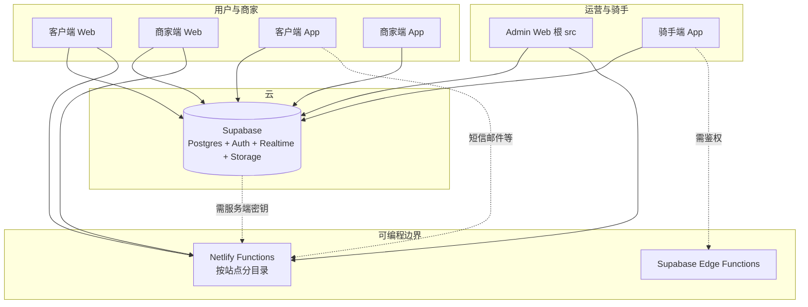

# MARKET LINK EXPRESS - AI 开发指南（架构全记录）

本文档供 AI 与开发者理解本**单仓多应用**仓库的**整体架构、五端关系、技术栈、目录职责、数据流、Netlify/Expo 部署约定**与**跨端业务概念**。

**最后更新：2026 年 4 月 2 日**（含架构章节整合）

---

## 目录（快速定位）

| 章节 | 内容 |
|------|------|
| §1 | 产品定位与五端 |
| §2 | 系统架构（图）与数据流 |
| §3 | 生产域名、Netlify 站点与 Base directory |
| §4 | 仓库目录与包职责 |
| §5 | 后端：Supabase、迁移、Serverless（Netlify / Supabase Edge） |
| §6 | 各子项目内部结构（Admin / 三 Web / 三 App） |
| §7 | 跨端共享逻辑与文件 |
| §8 | 构建命令与本地开发 |
| §9 | Netlify 通用约定与 Functions 清单 |
| §10 | 路由与页面索引（Web） |
| §11 | 核心页面与业务摘要 |
| §12 | 开发与部署注意事项 |
| §13 | Expo 商店版本号（EAS）— 必改文件 |
| §14 | 仓库内相关文档索引 |

---

## 1. 产品定位与五端

**MARKET LINK EXPRESS**（对客品牌名）是一套面向缅甸等地的**同城快递 / 物流**系统：用户下单、商家发单、平台运营与财务、骑手配送，共用 **Supabase** 中的订单与主数据。

| 端 | 路径 | 技术栈 | 生产入口（Web）/ 形态（App） |
|----|------|--------|------------------------------|
| **Admin 运营后台** | 仓库**根** `src/` | CRA5 + React18 + TS + React Router6 | 域名见 **§3**；Netlify 根目录构建 |
| **客户端 Web（C 端）** | `ml-express-client-web/` | CRA5 + React18 + TS + React Router7 | 会员、商城、追踪、法律页 |
| **商家端 Web（B 端）** | `ml-express-merchant-web/` | 同上 | 商家经营台、订单、商品、立即下单等 |
| **客户端 App** | `ml-express-client/` | Expo ~54、RN、已提交 `android`/`ios` | 应用商店；Deep Link 见该 App `App.tsx` |
| **商家端 App** | `ml-express-merchant-app/` | 同上 | 商家移动：`ml-express-merchants://` |
| **骑手端 App** | `ml-express-mobile-app/`（包名常写作 `market-link-express-mobile`） | Expo54、RN；多数无提交原生目录 | 骑手任务、地图、扫码；`ml-express-merchants://` 等为其他 scheme |

**共享后端**：各端用 **`@supabase/supabase-js`** 直连 `packages` 等表与 Storage；**不宜放在前端的操作**经 **Netlify Functions**（Node，按站点分目录）或 **Supabase Edge Functions**（`supabase/functions/`，如 `ensure-courier-auth`）提供。

---

## 2. 系统架构与数据流



**数据流要点**：

- 订单、用户、店铺、商品、财务等以 **Supabase 表**为唯一事实来源；多终端通过 **同一 anon key + RLS 策略**（以实际 Supabase 项目配置为准）访问。
- **实时性**：各端可对 `packages` 等开 **Supabase Realtime** 频道（如骑手 App `GlobalOrderMonitor`、聊天未读等）。
- **敏感能力**：短信/邮件验证码、管理密码、对账单、部分管理接口走 **Netlify Functions**；避免把 Twilio/邮件私钥写进 `REACT_APP_*` 以外的客户端 bundle（以各函数实现为准）。

---

## 3. 生产域名、Netlify 站点与 Base directory

三个 **Web 生产站点相互独立**；在 Netlify 上必须各自绑定域名，且 **Git 的 Base directory 不可混用**。

| 生产域名 | 本仓库构建目录 | Netlify `publish` | `deploy:netlify` 中的 site ID（`package.json`） |
|----------|----------------|-------------------|-----------------------------------------------|
| **https://market-link-express.com** | `ml-express-client-web` | `build` | `52f5f573-ca0a-4769-a8c7-e5f675764056` |
| **https://mlexpress-merchants.com** | `ml-express-merchant-web` | `build` | `126af2b9-244f-47fd-9be9-58fb45b6e7a2` |
| **https://admin-market-link-express.com** | **仓库根** | `build` | `ed9c2173-4031-4f10-a466-5b041dfe3511` |

- **环境变量**（每站点在 Netlify Dashboard 分别配置）：常见 `REACT_APP_SUPABASE_URL`、`REACT_APP_SUPABASE_ANON_KEY`、`REACT_APP_GOOGLE_MAPS_API_KEY`；Admin 与 Functions 可能另有 Twilio/邮件等（见 `netlify/functions` 源码）。
- **本地 CLI 易错点**：`netlify link` 会写 `.netlify/state.json`（通常 **gitignore**），在 monorepo 子目录 deploy 时若未带 `--site`，可能把代码推到**错误站点**。优先使用各目录 `npm run deploy:netlify`（已带 `--site`），或按目录分别 `netlify link --id <上表 ID>`。详见仓库根 `NETLIFY_DOMAIN_CONFIG.md`。
- **构建命令**（三站 `netlify.toml` 中常见）：`npm install --legacy-peer-deps && CI=false npm run build`；`NODE_VERSION=18` 等见各文件。

**旧版五端 ASCII 示意（保留）**：

```
+-----------------------------------------------------------------+
|  客户端 Web (ml-express-client-web)     ->  market-link-express  |
|  商家端 Web (ml-express-merchant-web)  ->  mlexpress-merchants   |
|  Admin（仓库根 src/）                    ->  admin-market-link…   |
|  客户端 / 商家 / 骑手 App                 ->  Expo / 商店         |
|  数据：Supabase；部分敏感：Netlify Functions / Supabase Edge    |
+-----------------------------------------------------------------+
```

---

## 4. 仓库目录与包职责

```
ml-express/                          # 本仓库根 = Admin Web
├── package.json                     # 根：Admin
├── src/                              # Admin 全部前端源码
│   ├── App.tsx, index.tsx
│   ├── pages/                        # 后台各业务页
│   ├── components/, hooks/, services/, contexts/
│   └── api/                          # 如 couriers
├── public/
├── netlify/                          # 根站点的 Functions
│   └── functions/
├── netlify.toml
├── supabase/                         # 仓库级：迁移与 Edge
│   ├── migrations/*.sql
│   └── functions/                    # 如 ensure-courier-auth
│
├── ml-express-client-web/            # C 端 Web
├── ml-express-merchant-web/          # B 端 Web
│
├── ml-express-client/                # C 端 App
├── ml-express-merchant-app/          # 商家 App
└── ml-express-mobile-app/            # 骑手 App
```

- **无** 共享的单一 `packages/` monorepo 库；各子项目**各自** `node_modules` 与 `package.json`。
- **根目录** 与三子 Web 各自维护 **`netlify.toml`** 与（若存在）**`netlify/functions`**，勿复制混用。

---

## 5. 后端：Supabase、迁移与 Serverless

| 类型 | 位置 | 说明 |
|------|------|------|
| **数据库** | Supabase 托管 Postgres | 业务表如 `packages`、`users`、店铺与商品、财务等；**以线上一致为准** |
| **迁移文件** | `supabase/migrations/*.sql` | 版本化 schema 变更；发布前与线上一致性由团队流程保证 |
| **Supabase Edge** | `supabase/functions/` 如 `ensure-courier-auth` | 与 riders / admin 联动的服务端逻辑，不在 CRA 中打包 |
| **Netlify Functions** | 每 Web 子树 `netlify/functions/*.js` | 短信/邮件验证、对账单、admin 工具等，见 **§9** |

客户端直连 Supabase 时，**`.env` / Netlify 环境变量** 中的 `REACT_APP_*` 在构建期注入；App 中多为 `expo-constants` / `app.config` 等。

---

## 6. 各子项目内部结构（索引级）

### 6.1 Admin（仓库根 `src/`）

- **入口**：`src/index.tsx` → `App.tsx`。
- **页面**：`src/pages/*`（如 `AdminDashboard`、`CityPackages`、`FinanceManagement`、`DeliveryStoreManagement`、`UserManagement`、`RealTimeTracking`、`SystemSettings` 等）。
- **服务**：`src/services/*`（`supabase.ts`、鉴权、短信、文件、错误处理等）；**`hooks/`** 含实时、节流等。
- **权限**：`ProtectedRoute` + 角色/permission（见 `App.tsx` 路由表）。

### 6.2 客户端 Web `ml-express-client-web/`

- **入口**：`src/index.tsx` → `App.tsx`；大量路由 `React.lazy` + `Suspense`。
- **大页**：`HomePage`、个人中心/商城/追踪/法律/删除账户等，见 `App.tsx`。
- **会话**：`ClientWebMerchantSessionGuard` 防止 C 端与 **商家** 会话混用。

### 6.3 商家端 Web `ml-express-merchant-web/`

- **布局**：`MerchantLayout`、`Sidebar`；`LoginPage` 外均需登录且 `userType === 'merchant'`。
- **主路由**：`/` → `ProfilePage`，`/products`，`/orders`（`TrackingPage` 等，以 `App.tsx` 为准）。

### 6.4 客户端 App `ml-express-client/`

- **导航**：`createNativeStackNavigator`；`Welcome` / `Main` / `MyOrders` / `OrderDetail` / `PlaceOrder` / `Profile` / 商城/购物车/地图等，见 `App.tsx`。
- **服务**：`src/services/*`（`supabase`、`chatService`、`notificationService`、`AnalyticsService` 等）。
- **全局**：`AppProvider`、`OrderAlertModal`、新订单待处理队列等。

### 6.5 商家端 App `ml-express-merchant-app/`

- 与客户端 App 结构类似，栈内为商家场景（`OrderAlertModal`、商品、我的订单、门店等），Deep Link 前缀 **`ml-express-merchants://`**。

### 6.6 骑手端 `ml-express-mobile-app/`

- **双角色 UI**：`App.tsx` 中根据 `userRole` 分 **Admin 端 Tab** 与 **Courier 端 Tab**（`CourierTabs`：首页、地图、扫码、我的等；Admin 有 Dashboard/财务等）。
- **全局监控**：`GlobalOrderMonitor` 订阅 `packages` 表，新指派订单时语音+震动；**地图页** 另通过 `DeviceEventEmitter` 展示新单横幅等。
- **路径**：`screens/` 含 `MapScreen`、`MyTasksScreen`、`PackageDetailScreen` 等；`services/` 与 `supabase` 封装订单、位置、通知。

---

## 7. 跨端共享逻辑与文件（仓库内可复用实现）

| 领域 | 位置或约定 |
|------|------------|
| **订单状态归一** | 如 `ml-express-mobile-app/utils/packageStatusNormalize.ts` 与各端对 `packages.status` 的展示映射 |
| **订单全链路文案（App）** | `ml-express-client/src/utils/orderJourney.ts`、`ml-express-merchant-app/src/utils/orderJourney.ts`：列表/详情的 `getJourneyCopy`、`getOrderListJourneyHint` |
| **地图 / Google** | 各站 `REACT_APP_GOOGLE_MAPS_API_KEY` 与 **Google Cloud HTTP referrer** 中登记各生产域名（见历史 `CLIENT_WEB_MAPS_*.md`） |
| **i18n** | Web：`LanguageContext`；App：`useApp` + `i18n` 工具，中/英/缅为主 |
| **权限与通知引导（App）** | `NotificationSettingsScreen` + `NotificationService.getDetailedPermissionStatus` + `expo-location` |

有业务变更时，需评估 **C/B/骑/管** 是否同步改展示或校验逻辑。

---

## 8. 构建命令与本地开发（npm scripts）

以下命令均在**对应目录**执行（各子项目独立 `package.json`）。

### 8.1 后台 Admin（仓库根目录）

| 脚本 | 说明 |
|------|------|
| `npm start` | `react-scripts start` |
| `npm run build` | `CI=false react-scripts build` → `build/` |
| `npm test` | Jest |
| `npm run deploy:netlify` | `netlify deploy --prod --build --site ed9c2173-...`（见 `package.json`） |
| `npm run build:netlify` | `netlify build` |

### 8.2 客户端 Web / 商家端 Web

`npm start` / `build` / `test` 标准 CRA；`deploy:netlify` 内联各自 **site id**（见 `package.json` 与 **§3**）。

### 8.3 Expo 应用（`ml-express-client`、`ml-express-merchant-app`）

| 脚本 | 说明 |
|------|------|
| `npm start` | `expo start` |
| `npm run start:offline` | 离线调试用 |
| `npm run android` / `ios` | `expo run:*`（Bare 工程） |
| `npm run web` / `build:web` | Web 导出 |

**版本号**：两 App 在仓库内**含** `android/`、`ios/`，**商店版本以原生工程为准**；发版见 **§13**。

### 8.4 骑手端（`ml-express-mobile-app`）

`npm start`、`expo run:android/ios`；`run-android.sh` 等见该目录 `package.json`。

---

## 9. Netlify：通用约定与 Functions 文件分布

### 9.1 三 Web 共性

- **Build**：`npm install --legacy-peer-deps && CI=false npm run build`；**Publish**：`build`。
- **Functions**：**各自**子目录的 `netlify/functions`，勿与别站混用。
- **SPA 回退**：`/*` → `/index.html`（200）。
- **可选**：`NETLIFY_SKIP_PLUGINS=true`、缓存头、下载 APK 的 `/download` 重定向（各站 `netlify.toml` 略有差异，商家端有「勿用无附件的 `releases/latest`」的注释）。

### 9.2 Admin（`netlify/functions`）

`send-sms.js`、`verify-sms.js`、`send-email-code.js`、`verify-email-code.js`、`send-order-confirmation.js`、`upload-banner.js`、`admin-password.js`、`verify-admin.js`、`ensure-courier-auth.js`、`utils/cors.js` 等（以实际目录为准）。

### 9.3 客户端 Web / 商家端 Web

常见：`send-sms.js`、`verify-sms.js`、`send-email-code.js`、`verify-email-code.js`、**`send-statement.js`**（两站有）、`utils/cors.js`。

生产 **短信/测试码** 行为以 `verify-sms` 等实现与注释为准，勿在客户端写死“万能码”业务逻辑（避免泄露策略）。

---

## 10. 路由与前端结构索引

### 10.1 Admin（`src/App.tsx`）

- 公开 `/` → `/admin/login`；**受保护** 路由含 `/admin/dashboard`、`/admin/city-packages`、`/admin/users`、`/admin/finance`、`/admin/tracking`、`/admin/realtime-tracking`、`/admin/settings`、`/admin/system-settings`、`/admin/accounts`、`/admin/banners`、`/admin/delivery-stores`、`/admin/supervision`、`/admin/delivery-alerts`、`/admin/recharges` 等，带角色与 `permissionId` 见源码。

### 10.2 客户端 Web

- 路由见 `ml-express-client-web/src/App.tsx`：`HomePage`、`/mall`、`/cart`、`/profile`、`/tracking`、政策页等；懒加载 + `Suspense`。

### 10.3 商家端 Web

- `/login`；受保护 `ProfilePage`（常作首页）、`StoreProductsPage`、`TrackingPage`（订单），见 `ml-express-merchant-web/src/App.tsx`。

---

## 11. 核心页面与业务逻辑（摘要）

### 11.1 商家端 Web 重点

- `ProfilePage.tsx`：体量大，含经营、休假、对账、立即下单相关逻辑；修改注意闭合与构建。
- `TrackingPage.tsx`、`StoreProductsPage.tsx`：订单与商品。

### 11.2 客户端 Web 重点

- 合规与账户：`PrivacyPolicyPage`、`TermsOfServicePage`、`DeleteAccount` 等；语言 `LanguageContext`。

### 11.3 业务概念与库表（方向性）

- **营业时间/休假/手工打烊**：`operating_hours`、`vacation_dates`、`manual_override_status` 等与下单页联动，以当前 schema 为准。
- **支付展示**：`payment_method`、描述字段中的 `余额支付/现金` 等标签；**财务对账**在 Admin `FinanceManagement` 等与订单完成、骑手结清等流程相关。
- **订单状态**：多终端需一致理解（待取件、配送中、已送达、异常等），避免仅改一方 UI。

---

## 12. 开发与部署注意事项

1. 巨型 `ProfilePage.tsx` 等改后运行 `build` 或 CI，避免未闭合标签。
2. **ESLint**：CRA 可能仅 warning；长期应消除；临时可用 `DISABLE_ESLINT_PLUGIN=true`（不推荐长期）。
3. **移动端发版**：**§13** 必读；**骑手端** 无提交原生时以 `app.json` 与 `eas.json` 的 `autoIncrement` 策略为准。
4. **隐私与商店**：对外 URL 与 C 站一致（如 `https://market-link-express.com/privacy-policy`）。
5. **Sentry**（部分 Web）：`REACT_APP_SENTRY_DSN` + 客户端 `LoggerService` 或 error service。
6. **Git 安全**：不在远程 URL 中嵌入个人 token；用 SSH/凭据管理。
7. **GitHub Release**：`/download` 若指向固定 APK 文件名，发版时附件必须存在（勿依赖空的 `latest` 附言）。

---

## 13. Expo 应用商店版本号（EAS）：必须改哪些文件

### 13.1 为什么「只改了 app.json」在 EAS 上仍是旧版本？

`ml-express-client` 与 `ml-express-merchant-app` 含 **已提交的 `ios/`、`android/`**。EAS 打 iOS/Android **商店包** 时以 **Xcode/Gradle 内版本**为主；**仅**改 `app.json` 而原生未同步则列表仍可能显示旧 `Marketing Version` / `versionCode`。**`appVersionSource: local` 的 Bare 工程仍须多文件一致**。

### 13.2 客户端 App（`ml-express-client`）发版

| 顺序 | 文件 | 说明 |
|------|------|------|
| | `app.json` | `expo.version`、`ios.buildNumber`、`android.versionCode` 等 |
| | `ios/.../Info.plist` | 若硬编码，与上同步 |
| | `ios/.../project.pbxproj` | `MARKETING_VERSION`、`CURRENT_PROJECT_VERSION`（**Debug/Release 均可能有两处**） |
| | `android/app/build.gradle` | `versionCode` / `versionName` |
| | `package.json` | `version` 建议同步 |

**自检示例**（仓库根）：

```bash
rg 'versionCode|versionName|MARKETING_VERSION|CURRENT_PROJECT_VERSION|CFBundleShortVersionString|CFBundleVersion|"version"' ml-express-client/app.json ml-express-client/package.json ml-express-client/android/app/build.gradle ml-express-client/ios -g '*.plist' -g '*.pbxproj'
```

### 13.3 商家端 App（`ml-express-merchant-app`）

同原则：`android/app/build.gradle`、`ios` 工程 `pbxproj` / `Info.plist` 与 `app.json` 对齐。

### 13.4 骑手端（`ml-express-mobile-app`）

若**无**提交 `android`/`ios`：以 **`app.json`** 的 `expo.version`、`ios.buildNumber`、`android.versionCode` 为主；`app.config.js` 通常合并 Key **不覆盖** 版本。`eas.json` 若 `production.autoIncrement: true` 可能云端自增，与本地期望不一致时改为 `false` 或按团队策略执行。若日后 `expo prebuild` 并提交原生目录，则与 **§13.2** 相同的多文件策略。

### 13.5 发版后验证

`git` 全量 `commit`+`push` 后再触发 EAS；在 **Expo Builds** 页确认**版本名与 build 号**再分发 IPA/AAB。

---

## 14. 仓库内相关文档索引

| 文档 | 内容方向 |
|------|----------|
| `NETLIFY_DOMAIN_CONFIG.md` | 三站域名、Base directory、Netlify CLI、DNS |
| `NETLIFY_DEPLOY_CHECKLIST.md` / `CLIENT_WEB_DEPLOYMENT_GUIDE.md` | 发布检查 |
| `ENV_VAR_SETUP.md` / `NETLIFY_ENV_UPDATE_INSTRUCTIONS.md` | 环境变量 |
| `CLIENT_WEB_MAPS_*.md` / `GOOGLE_MAPS_*.md` | 地图与 API Key 域名 |
| `DEPLOYMENT_*.md` / `VERCEL_USAGE_SUMMARY.md` | 历史部署说明（部分为 Netlify 现状的交叉引用） |
| `ml-express-mobile-app/docs/**` | 骑手端、登录、EAS 等 |
| 各子项目 `README.md` | 子项目级说明（若有） |

**维护约定**：子项目增删、换路由、增 Netlify 函数、换生产域名、换 Expo 策略时，**同步更新** 本文 **§1–§7、§3、§9、§10** 中对应表或段落。

---

*本文档为《MARKET LINK EXPRESS 单仓架构》的单一入口；与具体 PR 冲突时，以当前仓库内源码与 `netlify.toml` / `app.json` 为准。*
