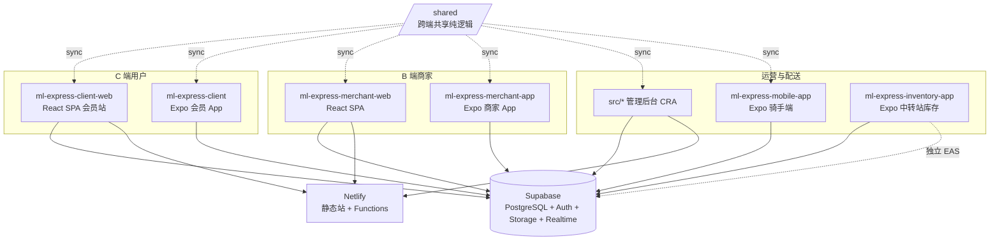
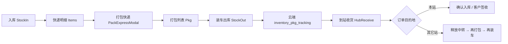

# MARKET LINK EXPRESS — AI 与维护者架构指南

本文档概括本仓库（**market-link-express / ml-express**）内所有产品形态、目录职责、数据边界、关键业务流程与部署关系，便于后续改需求或让 AI 快速建立上下文。**若本指南与代码不一致，以仓库当前文件为准，并请同步更新本文件。**

---

## 目录

1. [仓库总览](#1-仓库总览)
2. [子项目一览](#2-子项目一览)
3. [管理后台（仓库根 `src/`）](#3-管理后台仓库根-src)
4. [会员端网站 `ml-express-client-web`](#4-会员端网站-ml-express-client-web)
5. [商家端网站 `ml-express-merchant-web`](#5-商家端网站-ml-express-merchant-web)
6. [移动端应用（Expo）](#6-移动端应用expo-sdk-54)
7. [Inventory 中转站 App `ml-express-inventory-app`](#7-inventory-中转站-app-ml-express-inventory-app)
8. [中转物流业务流（MUSE → MDY → YGN）](#8-中转物流业务流muse--mdy--ygn)
9. [共享代码层 `/shared`](#9-共享代码层-shared)
10. [Supabase 与数据模型](#10-supabase-与数据模型)
11. [Netlify 部署](#11-netlify-部署)
12. [环境变量](#12-环境变量)
13. [给 AI / 维护者的改代码提示](#13-给-ai--维护者的改代码提示)
14. [常用文件速查](#14-常用文件速查)
15. [版本与分支](#15-版本与分支)

---

## 1. 仓库总览

本仓库是 **多包单体仓库（monorepo）**，但 **没有 npm workspaces**：根目录即 **管理后台 Web**；其余业务线为子目录独立应用，**各自**依赖 Supabase、各自独立部署（Netlify 静态站 / EAS 应用）。



**两条业务线（勿混表）：**

| 业务线 | 典型表 | 典型 App |
|--------|--------|----------|
| **City 配送 / 商城 / 跑腿** | `packages`、`orders`、`products`、`couriers`… | 会员/商家/骑手/管理后台 |
| **中转站库存 / 跨境包裹** | `inventory_*` | `ml-express-inventory-app` |

---

## 2. 子项目一览

| 目录 | 类型 | 角色 | 技术栈 | 部署 |
|------|------|------|--------|------|
| **`/`（仓库根）** | Web | **管理后台**：订单、用户、财务、跟踪、告警、合伙店铺、报表等 | CRA + TS + React Router **v6** | Netlify（根目录） |
| **`ml-express-client-web/`** | Web | **会员端网站**：首页、商城、购物车、账户 | CRA + TS + React Router **v7** | Netlify |
| **`ml-express-merchant-web/`** | Web | **商家端网站**：门店订单/商品/对账 | CRA + TS + React Router **v7** | Netlify |
| **`ml-express-client/`** | Mobile | **会员 App**（`com.mlexpress.client`） | Expo SDK 54 / RN | EAS |
| **`ml-express-merchant-app/`** | Mobile | **商家 App** | Expo SDK 54 / RN | EAS |
| **`ml-express-mobile-app/`** | Mobile | **骑手端**（`market-link-express-mobile`） | Expo SDK 54 / RN | EAS |
| **`ml-express-inventory-app/`** | Mobile | **中转站库存 App**（ML Inventory）：入库、打包、装车、到站收货、快递明细 | Expo SDK 54 / RN + **SQLite 本地缓存** | EAS（独立包名） |
| **`shared/`** | 共享源 | 跨端纯逻辑单一源（计费/商品审核/充值 QR） | TS | sync 进各 app |
| **`netlify/`** | 服务端 | 管理后台 Netlify Functions | Node | — |
| **`supabase/`** | 数据 | SQL migrations + Edge Functions | SQL / Deno | Supabase Cloud |
| **`design/` `specs/` `scripts/` `docs/`** | 资源 | 设计、规格、CI 脚本、归档文档 | — | — |

> 根 `package.json` 的 `name` 为 `market-link-express`，**代码职责是管理后台**；勿与 `ml-express-client-web` 站点混用 Base directory。

> 历史排障文档已归档至 `docs/archive/`；构建产物（apk/aab/zip）不入库（见 `.gitignore`）。

---

## 3. 管理后台（仓库根 `src/`）

### 3.1 目录结构

| 路径 | 职责 |
|------|------|
| `src/index.tsx` → `src/App.tsx` | 入口与路由表 |
| `src/pages/` | 页面（见下表） |
| `src/components/` | 通用与业务组件 |
| `src/layouts/` | `AdminShellLayout`（侧栏+顶栏） |
| `src/contexts/` | 全局 Context |
| `src/services/` | 数据/能力层 |
| `src/services/_shared/` | 由 `/shared` 同步（**勿手改**） |

### 3.2 路由与页面（以 `src/App.tsx` 为准）

根 `/` 重定向 **`/admin/login`**；受保护区 `**/admin/**` + `ProtectedRoute`（角色 + permissionId）。

| 路径 | 页面 | 权限要点 |
|------|------|----------|
| `/admin/login` | `AdminLogin.tsx` | 登录 |
| `/admin/dashboard` | `AdminDashboard(Home).tsx` | 仪表盘 |
| `/admin/delivery-stores` | `DeliveryStoreManagement.tsx` | **合伙店铺**（含中转站 `transit_station`） |
| `/admin/users` | `UserManagement.tsx` | `users` |
| `/admin/finance` | `FinanceManagement.tsx` | `finance` |
| `/admin/tracking` | `TrackingPage.tsx` / `RealTimeTracking.tsx` | `tracking` |
| `/admin/delivery-alerts` | `DeliveryAlerts.tsx` | 配送警报 |
| `/admin/recharges` | `RechargeManagement.tsx` | 充值 |
| `/admin/reports` | `AdminReportsPage.tsx` | 报表 |
| `/admin/courier-performance` | `CourierPerformancePage.tsx` | 骑手绩效 |
| `/admin/merchant-reconciliation` | `MerchantReconciliationExportPage.tsx` | 商家对账导出 |
| … | `CityPackages`、`BannerManagement`、`AccountManagement` 等 | 见 `App.tsx` |

### 3.3 Netlify Functions（根 `netlify/functions/`）

`send-email-code`、`verify-email-code`、`send-sms`、`admin-password`、`verify-admin`、`ensure-courier-auth`、`upload-banner`、`cleanup-delivery-photos` 等。

生产站点 ID（`deploy:netlify`）：`ed9c2173-4031-4f10-a466-5b041dfe3511`。

---

## 4. 会员端网站 `ml-express-client-web/`

- 仅服务会员（`localStorage`：`ml-express-customer`）。
- 目录：`src/{pages,components,contexts,services,constants,styles,utils}` + `src/services/_shared/`。
- 路由：`/`（着陆+内嵌服务/追踪/联系）、`/profile`、`/mall`、`/cart`、条款页等（`src/App.tsx`）。
- Netlify 站点 ID：`52f5f573-ca0a-4769-a8c7-e5f675764056`。

---

## 5. 商家端网站 `ml-express-merchant-web/`

- 目录：`src/{pages,components,contexts,hooks,services,…}` + `_shared/`。
- **下单弹窗**：`src/components/home/OrderModal.tsx` + `orderModalWizard.ts`（4 步向导）。
- 多规格：`ProductVariantPicker.tsx` + `utils/productVariants.ts`。
- Netlify 站点 ID：`126af2b9-244f-47fd-9be9-58fb45b6e7a2`。

---

## 6. 移动端应用（Expo SDK 54）

会员/商家 App：`src/{screens,components,contexts,services,…}`；骑手端无 `src/` 前缀（`screens/`、`services/` 在子项目根）。

| App | 包标识 | 核心屏幕 |
|-----|--------|----------|
| `ml-express-client` | `com.mlexpress.client` | Home、CityMall、PlaceOrder、Cart、MyOrders、TrackOrder… |
| `ml-express-merchant-app` | 商家包名 | 与会员类似 + 门店商品/订单 |
| `ml-express-mobile-app` | 骑手 | CourierHome、Map、Scan、PackageManagement、Finance… |

**共性**：`EXPO_PUBLIC_*` 或 `app.config` 注入 Supabase；与 CRA 的 `REACT_APP_*` **不互通**。

---

## 7. Inventory 中转站 App `ml-express-inventory-app`

独立 Expo 应用，供 Admin 创建的 **中转站合伙店铺**（`delivery_stores.store_type = transit_station`）使用。详细云端设计见 **`ml-express-inventory-app/docs/CLOUD_DATA_ARCHITECTURE.md`**。

### 7.1 定位与数据策略

- **登录**：`delivery_stores`（中转站类型）；P4 通过 Edge Function `inventory-store-login` 签发 Supabase Auth JWT（`app_metadata` 含 `inventory_store_code` / `inventory_hub_code`）。
- **本地**：SQLite（`expo-sqlite`）缓存 + 离线队列 `cloud_sync_queue`。
- **云端权威**：`inventory_*` 表（与 City 配送的 `packages`/`orders` **完全隔离**）。
- **多设备**：登录/下拉 → `syncPlatformInventoryCloud`；Realtime 防抖拉取。

### 7.2 目录结构

```
ml-express-inventory-app/src/
├── screens/           # 业务页（见 7.3）
├── components/      # HubReceiveOrdersModal、PackExpressModal、Pkg*Modal…
├── contexts/        # AuthContext（store + hubCode）
├── navigation/      # AppNavigator（Stack）
├── services/
│   ├── database.ts              # SQLite schema / migrations
│   ├── inventoryService.ts      # 核心业务（入库/打包/装车/到站/列表）
│   ├── trackingService.ts       # inventory_pkg/order_tracking 云端
│   ├── inventoryCloudSync.ts    # 拉取/推送/合并/装车双写
│   ├── inventoryCloudApi.ts     # Supabase inventory_* CRUD
│   ├── inventoryCloudQueue.ts  # 离线重试队列
│   ├── inventoryCloudRealtime.ts
│   ├── authService.ts           # 中转站登录会话
│   ├── hubTransportFeeService.ts # 到站车费支付状态
│   ├── financeLedgerService.ts  # 与财务流水联动
│   └── printerService.ts        # 标签打印（expo-print）
├── utils/
│   ├── expressDetailsVisibility.ts  # 区域可见性（快递明细/打包/云端合并）
│   ├── packDisplayStatus.ts         # 打包列表状态：未装车/已装车/已到站/已完成
│   ├── storeOwnership.ts            # MUSE/YGN/MDY 归属与编辑权限
│   ├── storeZone.ts                 # resolveStoreHubCode（YGN/MDY/MSE…）
│   ├── itemDestination.ts / packageNumber.ts / inboundBarcode.ts
│   └── …
└── types/             # inventory.ts, tracking.ts
```

### 7.3 屏幕与导航（`AppNavigator.tsx`）

| Screen | 标题 | 职责 |
|--------|------|------|
| `HomeScreen` | ML Inventory | 入口、统计、快捷入口 |
| `StockInScreen` | 入库 | 登记订单、生成入库条码 |
| `ItemsScreen` | **快递明细** | 订单列表、打包快递、多选打印 |
| `PkgScreen` | **打包** | 已打包 PKG 列表、编辑/拆包/打印 |
| `StockOutScreen` | **装车出库** | 选 PKG、选本段目的地、发车 |
| `HubReceiveScreen` | **到站收货** | 扫 PKG/订单、确认到站、分拨、付车费 |
| `ShipmentTrackScreen` | 在途追踪 | 发站视角看在途包 |
| `TrackExpressScreen` | 追踪快递 | 单笔查询 |
| `MovementsScreen` | 流水 | 出入库流水 |
| `CameraScanScreen` | 通用扫码 | |
| `SettingsScreen` | 设置 | 店铺信息、同步、退出 |
| `ItemFormScreen` | 商品 | 编辑订单字段 |

### 7.4 核心业务流程（代码路径）



| 步骤 | 关键函数 / 文件 |
|------|-----------------|
| 入库 | `inventoryService.applyStockMovement`（type=in） |
| 打包 | `createPackedShipment` → 本地 `packed_shipments` + 推 `inventory_packed_shipments` |
| 装车 | `applyTruckLoadOutbound` → `pushTruckLoadToCloud` + `trackingService.pushTruckLoadTracking` |
| 到站收包 | `trackingService.confirmPkgHubReceived` |
| 到站收单 | `confirmOrderHubReceived` / `confirmOrderInPackById` |
| 释放中转 | `releaseTransitOrdersAtHub` + `inventoryService.releaseHubTransitOrders` |
| 列表同步 | `syncPlatformInventoryCloud` → `pullPlatformInventoryFromCloud` |
| 到站写本地 | `importInboundPackToLocal` |

### 7.5 区域可见性（重要）

逻辑集中在 **`src/utils/expressDetailsVisibility.ts`** + **`packDisplayStatus.ts`**：

| 账号类型 | 快递明细 | 打包列表 PKG |
|----------|----------|--------------|
| **发站（MUSE）** | 本店登记的全部目的地订单 | 本店全部 PKG |
| **中转站（MDY）** | 本站 MDY 订单 + 经本站中转的订单 | 本站 PKG + 经本站 inbound 的中转 PKG |
| **目的站（YGN）** | **仅**最终目的地 YGN 的订单 | **仅**YGN 目的地且本站持有的 PKG |

相关 API：

- `isVisibleInExpressDetailsList` → `listItems` 过滤
- `isVisibleInPackedList` → `listPackedShipments` 过滤
- `canSelectPackedShipmentForTruckLoad` → `listOutboundPackages`（**已到站/在途不可再装车**）
- `canEditPackedShipment` → 打包页不可编辑
- `shouldMergeCloudItemToLocal` / `shouldMergeCloudPackToLocal` → 云端拉取过滤
- `pruneItemsOutsideExpressDetailsScope` / `prunePacksOutsideExpressDetailsScope` → 清理脏缓存

**目的站集合**（仅最终目的地、非中转）：`YGN`、`TGI`（见 `DESTINATION_ONLY_HUBS`）。

### 7.6 打包列表状态（`packDisplayStatus.ts`）

| display_status | 中文 | 条件概要 |
|----------------|------|----------|
| `pending_load` | 未装车 | 未出库 |
| `loaded` | 已装车 | 本地已出库，云端仍 `in_transit` |
| `arrived` | 已到站 | 云端 `hub_received` 且本地未同步出库等边缘情况 |
| `completed` | 已完成 | 云端 `hub_received`/`split_at_hub`/`completed` 且已装车；或本段运输结束 |

云端追踪状态：`inventory_pkg_tracking.status` → `in_transit` | `hub_received` | `completed` | `split_at_hub` | `cancelled`。

### 7.7 运行与构建

```bash
cd ml-express-inventory-app
cp .env.example .env   # EXPO_PUBLIC_SUPABASE_URL / ANON_KEY
npm install
npx expo start
```

合伙店铺须在管理后台 **店铺类型 = 中转站** 方可登录。

---

## 8. 中转物流业务流（MUSE → MDY → YGN）

典型场景：木姐 **MUSE** 发站入库 → 打包 → 装车；经 **MDY** 中转 → 最终 **YGN** 目的。

1. **MUSE 装车出库**：可选多个 PKG（如 `PKG*MDY*` + `PKG*YGN*`），**本段目的地**选 MDY（与包装号最终目的地可不同）。
2. **MDY 到站收货**：扫 PKG → 确认到站 → 弹窗分拨订单：
   - MDY 目的地订单 → 「确认入库」
   - YGN 等中转订单 → 「释放中转」→ 回到快递明细可再打包
3. **MDY 再装车**：将释放后的 YGN 订单重新打包，装车发往 YGN。
4. **YGN 到站**：仅看到 YGN 目的地订单/PKG；确认后客户签收。

**包装号规则**（`utils/packageNumber.ts`）：`PKG` + 年后两位 + **目的地码** + 件数 + 流水，例 `PKG26YGN10001`。

**本段运达站**：`packed_shipments.truck_leg_destination` / `inventory_pkg_tracking.leg_destination_code`（装车所选目的地，可与 `destination_code` 不同）。

---

## 9. 共享代码层 `/shared`

为减少 6 份 `supabase.ts` 重复，**纯逻辑**放在 `/shared/src`，经 `sync.mjs` 复制到各 app 的 `_shared/`（带 `AUTO-GENERATED` 头，**已提交 git**）。

| 文件 | 作用 | 消费方 |
|------|------|--------|
| `pricing.ts` | 计费规则合并 `buildPricingSettings` | admin、client、merchant、mobile |
| `productReview.ts` | 商品审核辅助 | merchant-web、merchant-app |
| `rechargeQr.ts` | 充值 QR 档位 | client、client-web |

- ❌ 不要改各 app 内 `_shared/` 副本。
- ✅ 只改 `/shared/src`，再 `npm run sync:shared`（根目录 `prestart`/`prebuild` 会自动跑）。
- **Inventory App 不使用 `/shared`**（独立业务线）。

---

## 10. Supabase 与数据模型

所有前后端共享 **同一 Supabase 项目**（各 app env 指向同一 URL）。

### 10.1 City 配送（会员/商家/骑手/后台）

举例：`packages`、`users`、`delivery_stores`、`couriers`、`products`、`delivery_alerts`、`recharge_requests`、`system_settings`、`banners`…

计费：`system_settings` 中 `pricing.{field}` 与 `pricing.{region}.{field}`。

### 10.2 Inventory 中转站（仅 Inventory App）

| 表 | 用途 |
|----|------|
| `inventory_store_items` | 订单/商品主数据（条码、目的地、打包状态、qty） |
| `inventory_stock_movements` | 入库/出库流水 |
| `inventory_packed_shipments` | 快递包头 |
| `inventory_packed_shipment_items` | 包内订单行 |
| `inventory_pkg_tracking` | 装车后在途 PKG 追踪 |
| `inventory_order_tracking` | 包内订单追踪（到站/释放） |

**登录账号**：仍用 `delivery_stores`（`store_type = transit_station`），与 City 业务共用合伙店铺体系，**不共用业务表**。

### 10.3 相关 migrations（`supabase/migrations/`）

| 文件 | 说明 |
|------|------|
| `20260610120000_inventory_shipment_tracking.sql` | PKG/订单追踪表 |
| `20260612120000_inventory_order_tracking_invoice_fields.sql` | 订单发票/费用字段 |
| `20260615120000_inventory_platform_store_data.sql` | 库存主表与包裹表 |
| `20260617120000_inventory_rls_by_delivery_store.sql` | RLS + JWT metadata |
| `20260618120000_inventory_store_items_pack_state.sql` | 打包状态字段 |
| `20260531120000_hub_transit_sorting.sql` | 中转分拨相关 |
| `20260531140000_pkg_tracking_transport_fee.sql` | 车费字段 |

部署：

```bash
supabase db push
supabase functions deploy inventory-store-login
supabase functions deploy inventory-clear-test-data   # 测试环境清空
```

### 10.4 Edge Functions（`supabase/functions/`）

| 函数 | 用途 |
|------|------|
| `inventory-store-login` | 中转站登录 + Auth JWT |
| `inventory-clear-test-data` | 清空 inventory 测试数据 |
| `ensure-courier-auth` | 骑手 Auth（City 业务） |

---

## 11. Netlify 部署

| 应用 | 配置文件 | Base directory | 站点 ID |
|------|----------|----------------|---------|
| 管理后台 | `/netlify.toml` | 仓库根 | `ed9c2173-…` |
| 会员 Web | `ml-express-client-web/netlify.toml` | `ml-express-client-web` | `52f5f573-…` |
| 商家 Web | `ml-express-merchant-web/netlify.toml` | `ml-express-merchant-web` | `126af2b9-…` |

构建：`npm install --legacy-peer-deps && CI=false npm run build`（触发 `prebuild` → `sync:shared`）。

**Inventory App 不走 Netlify**，使用 EAS Build。

---

## 12. 环境变量

| 环境 | 前缀 | 示例 |
|------|------|------|
| CRA（admin/client-web/merchant-web） | `REACT_APP_*` | `REACT_APP_SUPABASE_URL`、`REACT_APP_SUPABASE_ANON_KEY` |
| Expo（client/merchant/mobile/**inventory**） | `EXPO_PUBLIC_*` | 同上 + Inventory 见 `ml-express-inventory-app/.env.example` |
| Netlify Functions | Dashboard 配置 | 勿提交私钥 |

---

## 13. 给 AI / 维护者的改代码提示

1. **先确认业务线**：改 `inventory_*` / 装车/到站 → `ml-express-inventory-app`；改跑腿单 → City app + `packages`。
2. **改路由**：后台 Router v6（`/admin/*`）；会员/商家 Web Router v7。
3. **改 Inventory 区域可见性**：优先改 `expressDetailsVisibility.ts`，再查 `inventoryService.listItems` / `listPackedShipments` / `inventoryCloudSync.pullPlatformInventoryFromCloud`。
4. **改 Inventory 状态展示**：`packDisplayStatus.ts` + `trackingService` 云端 status。
5. **改计费/商品审核/充值 QR**：只改 `/shared/src`，不要改各 app `_shared/`。
6. **改 Supabase schema**：新增 `supabase/migrations/*.sql`，文档同步本文件 §10；Inventory 需考虑 RLS 与 App 离线队列。
7. **不要硬编码生产域名**；勿提交 `.env`、keystore。
8. **提交**：仅用户明确要求时 commit；单一主题。
9. **CI 类型检查**：`.github/workflows/typecheck.yml` + `scripts/typecheck-baselines.json`（Inventory App 暂未纳入基线，本地 `npx tsc --noEmit`）。

---

## 14. 常用文件速查

| 我想… | 先看 |
|--------|------|
| Inventory 订单列表过滤 | `expressDetailsVisibility.ts` → `inventoryService.listItems` |
| Inventory PKG 列表 / 装车候选 | `packDisplayStatus.ts` → `listOutboundPackages` |
| 到站收货 UI | `HubReceiveScreen.tsx`、`HubReceiveOrdersModal.tsx` |
| 装车出库 UI | `StockOutScreen.tsx`、`applyTruckLoadOutbound` |
| 云端同步/合并 | `inventoryCloudSync.ts` |
| 在途追踪读写 | `trackingService.ts` |
| 合伙店铺/中转站账号 | Admin `DeliveryStoreManagement.tsx`、`authService.ts` |
| 商家下单弹窗 | `merchant-web/.../OrderModal.tsx` |
| 会员/商家计费 | `/shared/src/pricing.ts` |
| 管理后台权限菜单 | `src/App.tsx`、`AccountManagement.tsx`、`AdminShellLayout` |

---

## 15. 版本与分支

- 根 `package.json`：`market-link-express` v2.2.4（管理后台）。
- 各子项目独立 `version`；Inventory：`ml-express-inventory-app/package.json`。
- 当前功能分支示例：`cursor/client-merchant-order-and-web`。

---

*最后更新：补充 `ml-express-inventory-app` 全架构、中转物流流程、`inventory_*` 数据模型、区域可见性与常用文件索引。*
