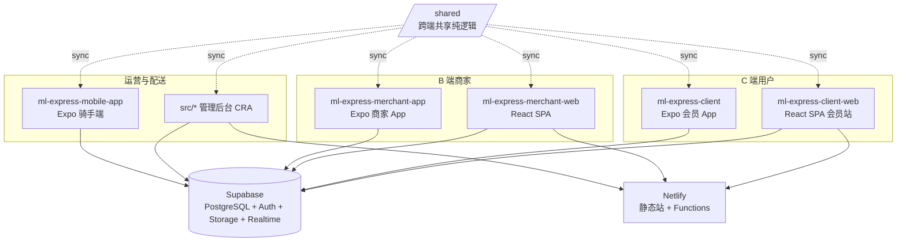

# MARKET LINK EXPRESS — AI 与维护者架构指南

本文档概括本仓库（**market-link-express / ml-express**）内所有产品形态、目录职责、文件路径、路由与部署关系，便于后续改需求时不混淆边界。**若本指南与代码不一致，以仓库当前文件为准，并请同步更新本文件。**

---

## 1. 仓库总览

本仓库是 **多包单体仓库（monorepo）**，但**没有 npm workspaces**：根目录即 **管理后台 Web**；其余业务线为子目录独立应用，**各自**依赖 Supabase、各自独立部署（Netlify 静态站 / EAS 应用）。



---

## 2. 子项目一览

| 目录 | 类型 | 角色 | 技术栈 | 部署 |
|------|------|------|--------|------|
| **`/`（仓库根）** | Web | **管理后台**：订单、用户、财务、跟踪、告警、账号权限、报表、骑手绩效、商家对账导出等 | CRA + TS + React Router **v6** | Netlify（根目录） |
| **`ml-express-client-web/`** | Web | **会员端网站**：首页、商城、购物车、账户、条款 | CRA + TS + React Router **v7** | Netlify |
| **`ml-express-merchant-web/`** | Web | **商家端网站**：门店订单/商品/对账（与商家 App 对齐） | CRA + TS + React Router **v7** | Netlify |
| **`ml-express-client/`** | Mobile | **会员 App**（`com.mlexpress.client`） | Expo SDK 54 / RN | EAS |
| **`ml-express-merchant-app/`** | Mobile | **商家 App** | Expo SDK 54 / RN | EAS |
| **`ml-express-mobile-app/`** | Mobile | **骑手/配送员端**（`market-link-express-mobile`） | Expo SDK 54 / RN | EAS |
| **`shared/`** | 共享源 | 跨端共享的**纯逻辑单一源**（见 §7） | TS | 经 sync 复制进各 app |
| **`netlify/`** | 服务端 | 管理后台 Netlify Functions（邮件/短信/管理鉴权等） | Node | — |
| **`supabase/`** | 数据 | 迁移与 functions | SQL | — |
| **`design/` `specs/` `memory/` `scripts/`** | 资源/文档 | 设计资产、规格、脚本 | — | — |

> 根 `package.json` 的 `name` 为 `market-link-express`，与 C 端品牌一致，但**代码职责是管理后台**；部署时勿与 `ml-express-client-web` 站点混用 Base directory。

> 📦 历史一次性文档/脚本（排障 `*.md`、建表 `*.sql`、诊断 `*.html`、临时脚本）已归档到 **`docs/archive/{md,sql,html,scripts}/`**，不代表当前架构。根目录现仅保留活跃配置与 `AI_GUIDE.md`。判断结构时以各 app 的 `src/` 与本指南为准。
>
> 🚫 构建产物（`*.apk` / `*.aab` / `*.zip` / `**/android/app/release/`）已加入 `.gitignore`，不再入库。

---

## 3. 管理后台（仓库根 `src/`）

### 3.1 目录结构

| 路径 | 职责 |
|------|------|
| `src/index.tsx` → `src/App.tsx` | 入口与路由表 |
| `src/pages/` | 页面（见 3.3） |
| `src/components/` | 通用与业务组件（全局搜索、待办栏、异常告警等） |
| `src/layouts/` | `AdminShellLayout`（侧栏+顶栏）等外壳 |
| `src/contexts/` | 全局 Context（如 `AdminTodoProvider`） |
| `src/services/` | 数据/能力层（见 3.2） |
| `src/hooks/` `src/utils/` `src/constants/` `src/types/` | 钩子 / 工具 / 常量 / 类型 |
| `src/api/` `src/assets/` `src/styles/` | API 封装 / 静态资源 / 样式 |
| `src/services/_shared/` | 由 `/shared` 同步生成（**勿手改**，见 §7） |

### 3.2 `src/services/` 关键文件

`supabase.ts`（后台主 API 封装，与 RLS/表名强相关）、`authService.ts`、`emailService.ts`、`smsService.ts`、`deliveryAlertService.ts`、`orderNotificationService.ts`、`adminInsightsService.ts`、`errorHandler.ts`、`FileUploadService.ts`、`FileValidationService.ts`、`ImageCompressionService.ts`、`_shared/{pricing,productReview,rechargeQr}.ts`。

### 3.3 路由与页面（以 `src/App.tsx` 为准）

- 根 `/` 重定向到 **`/admin/login`**；受保护区 `**/admin/***` 外层 `AdminShellLayout`，内层 `ProtectedRoute` 按**角色**（`admin`|`manager`|`operator`|`finance`）+ 可选 **permissionId** 控制。

| 路径 | 页面文件 | 权限要点 |
|------|----------|----------|
| `/admin/login` | `AdminLogin.tsx` | 登录 |
| `/admin/dashboard` | `AdminDashboard(Home).tsx` | 仪表盘 |
| `/admin/city-packages` | `CityPackages.tsx` | `city_packages` |
| `/admin/users` | `UserManagement.tsx` | `users` |
| `/admin/finance` | `FinanceManagement.tsx`(+`.translations.ts`) | `finance` |
| `/admin/tracking`、`/admin/realtime-tracking` | `TrackingPage.tsx` / `RealTimeTracking.tsx` | `tracking` |
| `/admin/settings`、`/admin/system-settings` | `SystemSettings.tsx` | `settings` |
| `/admin/accounts` | `AccountManagement.tsx` | 账号与权限 |
| `/admin/banners` | `BannerManagement.tsx` | 轮播 |
| `/admin/delivery-stores` | `DeliveryStoreManagement.tsx` | 送达店铺/商家 |
| `/admin/supervision`、`/admin/audit-logs` | `EmployeeSupervision.tsx` | 督导/审计 |
| `/admin/delivery-alerts` | `DeliveryAlerts.tsx` | 配送警报 |
| `/admin/recharges` | `RechargeManagement.tsx` | 充值管理 |
| `/admin/reports` | `AdminReportsPage.tsx` | 报表 |
| `/admin/courier-performance` | `CourierPerformancePage.tsx` | 骑手绩效 |
| `/admin/merchant-reconciliation` | `MerchantReconciliationExportPage.tsx` | 商家对账导出 |
| （另有）| `ImportMetricDraftsPage.tsx`、`ImportPriceListPage.tsx` | 导入/价目 |

### 3.4 服务端

- `netlify.toml` 在**仓库根**；`netlify/functions/`：`send-email-code.js`、`verify-email-code.js`、`send-sms.js`、`send-order-confirmation.js`、`admin-password.js`、`verify-admin.js`、`ensure-courier-auth.js`、`upload-banner.js`、`cleanup-delivery-photos.js`、`utils/`。
- 生产站点 ID（`deploy:netlify`）：`ed9c2173-4031-4f10-a466-5b041dfe3511`（以 Netlify 控制台为准）。

---

## 4. 会员端网站 `ml-express-client-web/`

- **仅服务会员**（`localStorage` 键 `ml-express-customer`）；检测到 `user_type==='merchant'` 会清空刷新（`App.tsx` 内 `ClientWebMerchantSessionGuard`）。
- 目录：`src/{pages,components,contexts,services,constants,styles,utils}` + `src/services/_shared/`。
- 路由（`src/App.tsx`）：`/`(`HomePage`，内嵌 `#landing-services`/`#landing-tracking`/`#landing-contact`)；`/services`、`/tracking`、`/contact` 重定向回 `/` 带 `state.landingScrollTo`；`/login`→`/`；`/profile`、`/mall`、`/mall/:storeId`、`/cart`；`/privacy-policy`、`/terms-of-service`。
- UI 外壳：`components/layout/ClientInteriorShell.tsx` + `styles/clientInterior.css`；着陆样式 `styles/homeLanding.css`。
- 数据：`src/services/supabase.ts`、`contexts/{LanguageContext,CartContext}`。
- Netlify：`ml-express-client-web/netlify.toml`，站点 ID `52f5f573-ca0a-4769-a8c7-e5f675764056`。

---

## 5. 商家端网站 `ml-express-merchant-web/`

- 目录：`src/{pages,components,contexts,hooks,services,constants,styles,utils}` + `src/services/_shared/`。
- 路由入口 `src/App.tsx`（`/login`、`/`、`/products`、`/orders` 等）。
- **下单弹窗**：`src/components/home/OrderModal.tsx` + `orderModalWizard.ts`（4 步向导：地址/包裹/配送/确认）；下单逻辑在 `src/pages/ProfilePage.tsx`。多规格：`src/components/ProductVariantPicker.tsx` + `src/utils/productVariants.ts`。
- 数据：`src/services/supabase.ts`（与后台/会员同一 Supabase 项目，RLS 区分角色）。
- Netlify：`ml-express-merchant-web/netlify.toml`，站点 ID `126af2b9-244f-47fd-9be9-58fb45b6e7a2`。

---

## 6. 移动端应用（Expo SDK 54）

三者目录结构相近：会员/商家 App 用 `src/{screens,components,contexts,hooks,services,config,constants,utils}`；骑手端把这些放在**仓库子目录根**（`screens/`、`services/` 等，无 `src/`）。

### 6.1 `ml-express-client/`（会员 App，`com.mlexpress.client`）
- 屏幕（`src/screens/`）：`Home`、`Login`/`Register`/`Welcome`、`CityMall`、`MerchantProducts`、`Cart`、`PlaceOrder`、`MyOrders`、`OrderDetail`、`TrackOrder`、`AddressBook`、`Profile`、`Notification*`。
- 下单组件：`src/components/placeOrder/{SenderForm,ReceiverForm,OrderWizardProgress}.tsx`；`src/screens/PlaceOrderScreen.tsx`。
- 数据：`src/services/supabase.ts` + `src/services/_shared/`。

### 6.2 `ml-express-merchant-app/`（商家 App）
- 屏幕与会员 App 基本同名（含 `MerchantProductsScreen`、`PlaceOrderScreen` 等）。
- 多规格：`src/components/ProductVariantPicker.tsx` + `src/utils/productVariants.ts`。
- 数据：`src/services/supabase.ts`（体量大：订单/商品/店铺）+ `src/services/_shared/`。

### 6.3 `ml-express-mobile-app/`（骑手端，`market-link-express-mobile`）
- 屏幕（`screens/`）：`CourierHome`、`Dashboard`、`MyTasks`、`Map`/`MapView`、`Scan`/`Scanner`、`PackageManagement`/`PackageDetail`、`DeliveryHistory`、`FinanceManagement`、`Performance/Statistics`、`LocationDisclosure`、`Login`、`Profile`、`Settings`。
- 目录：`navigation/`、`screens/`、`components/`、`contexts/`、`hooks/`、`services/`（含 `services/_shared/`）、`database/`、`utils/`、`constants/`、`docs/`。

**移动端共性**：环境变量用 `EXPO_PUBLIC_*` 或 `app.config`/`Constants.expoConfig.extra` 注入；与 CRA 的 `REACT_APP_*` **不互通**。

---

## 7. 共享代码层 `/shared`（重要）

为减少 6 份 `supabase.ts` 重复维护，**纯逻辑**抽到 `/shared` 单一源，经同步脚本复制到各 app。

### 7.1 为什么用「同步」而非 workspaces/共享包
- 无 npm workspaces；3 个 CRA app 的 `ModuleScopePlugin` **禁止 import `src/` 外部文件**；各 app 独立部署（Netlify 按子目录 base / EAS 各自构建）。
- 真共享包需改 craco/metro/部署命令，风险高。故采用「源 + 同步脚本 + 提交副本」。

### 7.2 结构与机制
```
shared/
├── src/
│   ├── pricing.ts        # 计费合并算法 buildPricingSettings + 领区解析
│   ├── productReview.ts  # Product/ProductVariant 类型 + 上架审核辅助
│   └── rechargeQr.ts     # 充值 QR key/档位 + 合并逻辑
├── sync.mjs              # 无依赖复制脚本：/shared/src → 某 app 的 _shared
└── README.md
```
- 各 app 的 `package.json` 有 `sync:shared` 脚本 + `prestart`/`prebuild` 钩子，构建/启动时自动复制到：
  - CRA/会员App/商家App：`src/services/_shared/`
  - 骑手端：`services/_shared/`
- 同步产物带 `AUTO-GENERATED` 头注释、**已提交 git**，故 Netlify/EAS 无需特殊配置。

### 7.3 规则
- ❌ **不要改任何 app 里 `_shared/` 下的文件**（会被覆盖）。
- ✅ 只改 `/shared/src/*`，再 `npm run sync:shared`（或直接 `npm start`/`npm run build`）。
- 只放**环境无关纯逻辑**；`createClient`、env 读取、retry/错误处理、各端默认值、输出键风格（snake/camel）保留在各 app 本地，经参数注入。
- 各端 `getPricingSettings` = 本地拉取 `system_settings` → 调 `buildPricingSettings(rows, region, { defaults, toField? })`；admin/mobile 的 `getRegionalPricingMap`（语义不同，无 mandalay 兜底）保留各自实现。

---

## 8. Supabase 与数据模型（跨项目）

- 所有前后端共享 **同一 Supabase 项目**（由各自 env 指向）。
- 业务表举例：`packages`、`users`、`delivery_stores`、`couriers`、`products`、`delivery_alerts`、`recharge_requests`、`system_settings`、`banners`、`tutorials` 等。
- 计费规则存 `system_settings`：全局 `pricing.{field}` + 领区 `pricing.{region}.{field}`；无 Realtime，各端按需 `getPricingSettings()` 拉取；历史订单 `price`/`pricing_base_fee_mmk` 为快照不随改价变动。
- 充值 QR 配置键：`client.recharge_qr_urls`。
- 各子项目 **`supabase.ts` 多份**；改接口时注意是否需同步多处（纯逻辑优先抽到 `/shared`）。
- 注意：表若缺列（历史代码引用不存在字段），PostgREST 对非法 `select` 返回 **400**，需与真实 schema 对齐。

---

## 9. Netlify 部署约定

| 应用 | 配置文件 | Base directory | 站点 ID |
|------|----------|----------------|---------|
| 管理后台 | `/netlify.toml` | 仓库根 | `ed9c2173-…` |
| 会员 Web | `ml-express-client-web/netlify.toml` | `ml-express-client-web` | `52f5f573-…` |
| 商家 Web | `ml-express-merchant-web/netlify.toml` | `ml-express-merchant-web` | `126af2b9-…` |

- 构建命令均为 `npm install --legacy-peer-deps && CI=false npm run build`，故 `prebuild`（`sync:shared`）会执行。
- **自定义域名**：DNS 仅指向**一个**生产站点；勿同主机名 CNAME 到多个 `*.netlify.app`，否则部分网络「找不到服务器」或证书异常。

---

## 10. 环境变量

- **CRA**：`REACT_APP_SUPABASE_URL`、`REACT_APP_SUPABASE_ANON_KEY`、`REACT_APP_GOOGLE_MAPS_API_KEY`、各类 `REACT_APP_*_URL`；会员 Web 邮件可选 `REACT_APP_EMAIL_FUNCTION_URL`。
- **Expo**：`EXPO_PUBLIC_*` 或 `app.config`/`Constants.expoConfig.extra`（如 `supabaseUrl`/`supabaseAnonKey`/`netlifyUrl`）。
- **Netlify Functions**：密钥在 Netlify Dashboard，勿提交私钥。本地用各 app 的 `.env.local`（见各自 `.env.example` / `env.example`）。

---

## 11. 给后续改代码的提示

1. **改路由**：先确认是根 `src/`（后台，Router v6）还是 `*-web/src/`（会员/商家，Router v7），路径前缀与版本不同。
2. **改后台权限**：新页面需同时改 `ProtectedRoute`、`AccountManagement` 权限列表、`AdminShellLayout` 菜单。
3. **改 C 端着陆页块**：`HomePage` 内嵌 `ServicesPage`/`TrackingPage`/`ContactPage` 的 `embedInLanding` 模式不重复导航栏。
4. **改数据层纯逻辑**（计费/商品审核/充值QR）：改 `/shared/src`，**不要**逐个 app 改 `supabase.ts`，更不要改 `_shared/` 副本。
5. **不要硬编码生产域名**拼接资源/API，优先相对路径或 `window.location.origin`。
6. **提交**：仅在用户明确要求时提交；保持单一主题、勿混入无关 WIP；勿提交密钥/`.env`。

---

## 12. 版本与同步

- 根 `package.json`：`market-link-express`（管理后台）。
- 各子目录另有独立 `version`，发布流程相互独立。
- 当前主分支工作分支示例：`cursor/client-merchant-order-and-web`。

---

*最后更新：补充完整目录路径、各 app 结构、`/shared` 共享机制与部署矩阵。供 AI 与维护者快速建立上下文。*
