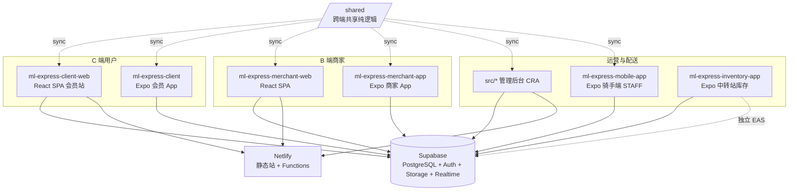
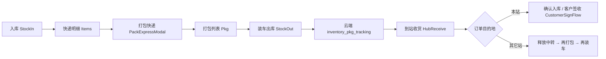

# MARKET LINK EXPRESS — AI 与维护者架构指南

本文档概括本仓库（**market-link-express / ml-express**）内所有产品形态、目录职责、数据边界、关键业务流程与部署关系，便于后续改需求或让 AI 快速建立上下文。**若本指南与代码不一致，以仓库当前文件为准，并请同步更新本文件。**

---

## 目录

1. [仓库总览](#1-仓库总览)
2. [生产域名与部署矩阵](#2-生产域名与部署矩阵)
3. [子项目一览](#3-子项目一览)
3.1. [各子项目架构详解（总览）](#31-各子项目架构详解总览)
4. [管理后台（仓库根 `src/`）](#4-管理后台仓库根-src)
5. [会员端网站 `ml-express-client-web`](#5-会员端网站-ml-express-client-web)
6. [商家端网站 `ml-express-merchant-web`](#6-商家端网站-ml-express-merchant-web)
7. [会员 App `ml-express-client`](#7-会员-app-ml-express-client)
8. [商家 App `ml-express-merchant-app`](#8-商家-app-ml-express-merchant-app)
9. [骑手/员工 App `ml-express-mobile-app`](#9-骑手员工-app-ml-express-mobile-app)
10. [Inventory 中转站 App `ml-express-inventory-app`](#10-inventory-中转站-app-ml-express-inventory-app)
11. [Admin 跨境物流控制台](#11-admin-跨境物流控制台)
12. [中转物流业务流（MUSE → MDY → YGN）](#12-中转物流业务流muse--mdy--ygn)
13. [共享代码层 `/shared`](#13-共享代码层-shared)
14. [Supabase 与数据模型](#14-supabase-与数据模型)
15. [Netlify 与 EAS 部署](#15-netlify-与-eas-部署)
16. [环境变量](#16-环境变量)
17. [常见问题与排障](#17-常见问题与排障)
18. [给 AI / 维护者的改代码提示](#18-给-ai--维护者的改代码提示)
19. [常用文件速查](#19-常用文件速查)
20. [版本与分支](#20-版本与分支)
21. [CI 与质量门禁](#21-ci-与质量门禁)

---

## 1. 仓库总览

本仓库是 **多包单体仓库（monorepo）**，但 **没有 npm workspaces**：根目录即 **管理后台 Web**；其余业务线为子目录独立应用，**各自**依赖 Supabase、各自独立部署（Netlify 静态站 / EAS 应用）。



### 两条业务线（勿混表）

| 业务线 | 典型表 | 典型 App / 模块 |
|--------|--------|-----------------|
| **City 配送 / 商城 / 跑腿** | `packages`、`orders`、`products`、`couriers`… | 会员/商家/骑手 App + 管理后台 City 模块 |
| **中转站库存 / 跨境包裹** | `inventory_*`、`cross_border_manual_entries` | `ml-express-inventory-app` + Admin **跨境物流** |

### 认证体系概览

| 端 | 登录方式 | 会话存储 |
|----|----------|----------|
| 会员 Web/App | `users` 表（customer）邮箱/手机 + 密码 | `localStorage` / `AsyncStorage` |
| 商家 Web/App | `delivery_stores` 店铺码 + 密码 | `localStorage` / `AsyncStorage` |
| 骑手 App | `admin_accounts` + `ensure-courier-auth` Edge Function | `AsyncStorage` |
| 管理后台 | `verify-admin` Netlify Function + HMAC JWT Cookie | session/localStorage |
| Inventory App | `inventory-store-login` Edge Function → Supabase Auth JWT | SecureStore + Supabase Auth |

---

## 2. 生产域名与部署矩阵

| 产品 | 典型域名 / 渠道 | 说明 |
|------|-----------------|------|
| 会员 Web | `market-link-express.com` | `ml-express-client-web` Netlify |
| 管理后台 | `admin-market-link-express.netlify.app` 或自定义 admin 域 | 仓库根 CRA + Functions |
| 商家 Web | 独立 Netlify 站点 | `ml-express-merchant-web` |
| Inventory App Support | `https://market-link-express.com/support` | App Store Support URL |
| Inventory iOS | App Store `com.mlexpress.inventory` | EAS Build，当前 **1.6.0 (12)** |
| Supabase | `uopkyuluxnrewvlmutam.supabase.co` | 全端共用同一项目 |

> ⚠️ 勿在 App Store 使用无效域名（如 `linkexpress.com/support`）；Support URL 必须可访问。

---

## 3. 子项目一览

| 目录 | 类型 | 角色 | 技术栈 | 当前版本 | 部署 |
|------|------|------|--------|----------|------|
| **`/`（仓库根）** | Web | **管理后台**：订单、用户、财务、跟踪、告警、合伙店铺、报表、跨境物流 | CRA + TS + React Router **v6** | **2.2.4** | Netlify（根目录） |
| **`ml-express-client-web/`** | Web | **会员端网站**：首页、商城、购物车、账户、Support | CRA + TS + React Router **v7** | **0.1.0** | Netlify |
| **`ml-express-merchant-web/`** | Web | **商家端网站**：门店订单/商品/对账 | CRA + TS + React Router **v7** | **0.1.0** | Netlify |
| **`ml-express-client/`** | Mobile | **会员 App** `com.mlexpress.client` | Expo SDK 54 / RN 0.81 | **2.5.2 (66)** | EAS |
| **`ml-express-merchant-app/`** | Mobile | **商家 App** `com.mlexpress.merchants` | Expo SDK 54 / RN 0.81 | **2.4.0 (11)** | EAS |
| **`ml-express-mobile-app/`** | Mobile | **骑手/员工端** `com.mlexpress.courier` | Expo SDK 54 / RN 0.81 | **2.3.7 (76)** | EAS |
| **`ml-express-inventory-app/`** | Mobile | **中转站库存 App** `com.mlexpress.inventory` | Expo SDK 54 + Supabase Auth + 蓝牙打印 | **1.6.0 (12)** | EAS |
| **`shared/`** | 共享源 | 跨端纯逻辑单一源 | TS | — | sync 进各 app |
| **`netlify/`** | 服务端 | 管理后台 Netlify Functions | Node | — | — |
| **`supabase/`** | 数据 | SQL migrations + Edge Functions | SQL / Deno | — | Supabase Cloud |
| **`design/` `specs/` `scripts/` `docs/`** | 资源 | 设计、规格、CI 脚本、归档文档 | — | — | — |

> 根 `package.json` 的 `name` 为 `market-link-express`，**代码职责是管理后台**；勿与 `ml-express-client-web` 站点混用 Base directory。

> 历史排障文档已归档至 `docs/archive/`；构建产物（apk/aab/zip）不入库（见 `.gitignore`）。

---

## 3.1 各子项目架构详解（总览）

以下为 **8 个可部署子项目** 的统一架构说明。改代码前先确认业务线（§1）与认证方式（§1 认证表）。

### 架构分层（通用模式）

```
┌─────────────────────────────────────────┐
│  UI 层：pages/screens/components        │
├─────────────────────────────────────────┤
│  状态层：contexts/hooks                 │
├─────────────────────────────────────────┤
│  业务层：services/*.ts（巨型 supabase.ts│
│          或 inventoryService 等）        │
├─────────────────────────────────────────┤
│  共享逻辑：/shared → 各 app _shared/    │
├─────────────────────────────────────────┤
│  数据层：Supabase JS / Netlify Fn / RPC │
│          （Inventory 另有 45s 内存缓存）  │
└─────────────────────────────────────────┘
```

### 3.1.1 管理后台（仓库根 `/`）

| 维度 | 说明 |
|------|------|
| **定位** | 内部运营：City 包裹/财务/跟踪/告警 + 跨境物流控制台 + 指标/代购 |
| **入口** | `src/index.tsx` → `src/App.tsx`（React Router **v6**） |
| **UI** | `src/pages/`（32+ 页）、`AdminShellLayout`；全屏独立模块见 §4.3 |
| **业务层** | `src/services/supabase.ts`（City 主业务）、`inventoryConsoleService.ts`（跨境）、`authService.ts` |
| **服务端** | `netlify/functions/`（Admin JWT 校验、跨境 CRUD、短信/邮件） |
| **认证** | `verify-admin` + HMAC JWT Cookie；角色 `admin\|manager\|operator\|finance` + `permissionId` |
| **数据** | Supabase 直连（anon key）；跨境写操作经 Netlify Function + service role |
| **共享** | `prebuild` → `sync:shared` → `src/services/_shared/` |
| **部署** | Netlify site `ed9c2173-…`；`npm run deploy:netlify` |

### 3.1.2 会员 Web（`ml-express-client-web/`）

| 维度 | 说明 |
|------|------|
| **定位** | C 端官网：着陆、商城、购物车、账户、合规/Support |
| **入口** | `src/index.tsx` → `src/App.tsx`（React Router **v7**） |
| **UI** | `src/pages/`（14 页）；`LanguageProvider`、`CartProvider` |
| **业务层** | `src/services/supabase.ts` + `_shared/` |
| **服务端** | `netlify/functions/`：`merchant-apply`、`send-sms`、`send-statement` 等 |
| **认证** | `users`（customer）→ `localStorage`（`ml-express-customer`）；**非 Supabase Auth** |
| **路由** | `/`、`/mall`、`/cart`、`/profile`、`/support`、`/ml-inventory/privacy`、合规页 |
| **部署** | Netlify site `52f5f573-…`；Base directory = 本子目录 |

### 3.1.3 商家 Web（`ml-express-merchant-web/`）

| 维度 | 说明 |
|------|------|
| **定位** | B 端轻量后台：门店资料、商品、订单跟踪 |
| **入口** | `src/index.tsx` → `src/App.tsx`（Router **v7**） |
| **UI** | `LoginPage`、`ProfilePage`、`StoreProductsPage`、`TrackingPage`；`OrderModal` 4 步下单向导 |
| **业务层** | `src/services/supabase.ts` + `_shared/`（含 `merchantLoginGuard`） |
| **认证** | `delivery_stores` 店铺码 + 密码 → `localStorage`；**拒绝** `transit_station` |
| **路由** | `/login` → `/`（Profile）、`/products`、订单经 Profile/Tracking |
| **部署** | Netlify site `126af2b9-…` |

### 3.1.4 会员 App（`ml-express-client/`）

| 维度 | 说明 |
|------|------|
| **定位** | C 端原生：下单、追踪、商城、充值、通知 |
| **入口** | `index.js` → `App.tsx`（React Navigation 6 Native Stack） |
| **UI** | `src/screens/`（16 Screen）、`src/components/` |
| **状态** | `AppContext`、`CartContext`、`LoadingContext` |
| **业务层** | `supabase.ts`、`DatabaseService.ts`（SQLite 缓存）、`notificationService.ts`、`appUpdateService.ts` |
| **工具** | `mediaAccess.ts`（Android Photo Picker，无 READ_MEDIA 权限）、`appUpdate.ts` |
| **认证** | `users` customer → `AsyncStorage`；支持游客；商家分支走 `delivery_stores` |
| **Deep link** | `ml-express-client://`；关联域 `mlexpress.com` |
| **Google Play** | `blockedPermissions` 屏蔽 READ_MEDIA_*；选图走系统 Photo Picker |
| **部署** | EAS projectId `80b0873d-…`；profiles：`apk` / `production`（AAB） |

**屏幕导航**：Welcome → Login/Register → Main(Home) → PlaceOrder、MyOrders、TrackOrder、CityMall、Cart、MerchantProducts、Profile、OrderDetail、AddressBook、NotificationCenter…

### 3.1.5 商家 App（`ml-express-merchant-app/`）

| 维度 | 说明 |
|------|------|
| **定位** | B 端原生：与会员 App 架构镜像，侧重门店订单/商品管理 |
| **入口** | `index.js` → `App.tsx` |
| **包名** | `com.mlexpress.merchants`；scheme `ml-express-merchants://` |
| **差异** | 额外 `expo-image-manipulator`；Screen 命名与 client 基本一致 |
| **认证** | `delivery_stores` + `merchantLoginGuard`（拦截中转站账号） |
| **共享** | `src/services/_shared/`（含 `productReview.ts`） |
| **部署** | EAS projectId `0c1336bd-…` |

### 3.1.6 骑手/员工 App（`ml-express-mobile-app/`）

| 维度 | 说明 |
|------|------|
| **定位** | STAFF：骑手配送 + 管理员督导（双角色 Tab） |
| **入口** | `index.ts` → `App.tsx`；显示名 **MARKET LINK STAFF** |
| **目录** | 无 `src/` 前缀：`screens/`、`services/`、`navigation/`（lazyScreens）、`contexts/` |
| **业务层** | `supabase.ts`、`locationService`、`notificationService` |
| **特性** | `@sentry/react-native`；后台定位（`expo-task-manager`）；`RoleGuardScreen` |
| **认证** | `admin_accounts` + Edge/Netlify `ensure-courier-auth`；`persistSession: false` |
| **导航** | Stack + 双 Tab 组：Admin（Dashboard/Map/Scan/Profile）vs Courier（MyTasks/Map/Scan/Profile） |
| **部署** | EAS projectId `9831d961-…`；`build:aab` |

### 3.1.7 Inventory 中转站 App（`ml-express-inventory-app/`）

| 维度 | 说明 |
|------|------|
| **定位** | 跨境包裹全链路：入库→打包→装车→到站→签收 |
| **入口** | `App.tsx`：AuthProvider → Login / `AppNavigator` |
| **认证** | **唯一使用 Supabase Auth JWT 的移动端**；`inventory-store-login` Edge Function |
| **数据** | **在线专用**：`inventory_*` 表 + RPC 幂等事务；45s 内存缓存（`inventoryCloudStore`） |
| **不写 shared** | `sync:shared` 为空操作 |
| **测试** | `vitest`（单元测试，`npm test`） |
| **详细** | 见 §10（屏幕、区域可见性、打印、签收流程） |

### 3.1.8 共享层（`/shared/`）

| 维度 | 说明 |
|------|------|
| **机制** | 单一源 `shared/src/*.ts` → `sync.mjs` → 各 app `_shared/`（AUTO-GENERATED，已提交 git） |
| **源文件（7）** | `pricing.ts`、`productReview.ts`、`rechargeQr.ts`、`merchantLoginGuard.ts`、`merchantStoreTypes.ts`、`domainTypes.ts`、`services.ts` |
| **消费方** | Admin、client-web、merchant-web、client、merchant-app、mobile-app（**不含 Inventory**） |
| **规则** | ❌ 勿改 `_shared/` 副本；✅ 只改 `/shared/src` 后 `npm run sync:shared` |

### 3.1.9 Supabase 后端（`supabase/`）

| 维度 | 说明 |
|------|------|
| **项目** | `uopkyuluxnrewvlmutam.supabase.co`（全端共用） |
| **Migrations** | **47** 个 SQL 文件（`supabase/migrations/`） |
| **Edge Functions** | 4 个：`inventory-store-login`、`inventory-change-password`、`inventory-clear-test-data`、`ensure-courier-auth` |
| **业务域** | City（`packages`/`users`…）与 Inventory（`inventory_*`）**表隔离**，见 §14 |

### 3.1.10 CI 与脚本（`scripts/`、`.github/`）

| 项 | 说明 |
|----|------|
| **CI** | `.github/workflows/typecheck.yml`：7 子项目 `tsc --noEmit`（基线门禁） |
| **脚本** | `scripts/ci-typecheck.mjs` + `typecheck-baselines.json` |
| **其它** | `scripts/` 含密码迁移、图标同步等运维脚本 |

---

## 4. 管理后台（仓库根 `src/`）

### 4.1 技术栈

- **React 18** + **TypeScript 4.9** + **react-scripts 5**（CRA）
- **react-router-dom v6**
- **@supabase/supabase-js ^2.76**
- 地图：**@react-google-maps/api**；图表：**recharts**；Excel：**exceljs**；OCR：**tesseract.js**
- 服务端：**twilio**、**nodemailer**（Netlify Functions）

> 架构总览见 [§3.1.1](#311-管理后台仓库根-)。

### 4.2 目录结构

| 路径 | 职责 |
|------|------|
| `src/index.tsx` → `src/App.tsx` | 入口与路由表 |
| `src/pages/` | 页面（见 §4.3） |
| `src/components/` | 通用与跨境组件（`CrossBorder*`、`CblTablePagination`） |
| `src/layouts/AdminShellLayout.tsx` | 侧栏+顶栏；`STANDALONE_ADMIN_MODULE_PATHS` |
| `src/contexts/` | 含 `AdminTodoContext` |
| `src/services/supabase.ts` | Supabase 客户端 + 各业务 service |
| `src/services/inventoryConsoleService.ts` | 跨境 Admin API 客户端 |
| `src/utils/crossBorderHubs.ts` | MUSE/MDY/YGN 枢纽与账号草稿 |
| `src/styles/crossBorderLogistics.css` | 跨境独立页样式 |
| `src/services/_shared/` | `/shared` 同步副本（**勿手改**） |
| `netlify/functions/` | 服务端（§4.7） |

### 4.3 路由与页面（`src/App.tsx`）

根 `/` → `/admin/login`；`**/admin/**` + `ProtectedRoute`（角色 + `permissionId`）。

| 路径 | 页面 | 权限 |
|------|------|------|
| `/admin/login` | `AdminLogin` | — |
| `/admin/dashboard` | 仪表盘 | 默认 |
| `/admin/city-packages` | City 包裹 | `city_packages` |
| `/admin/users` | 用户 | `users` |
| `/admin/finance` | 财务 | `finance` |
| `/admin/tracking` / `realtime-tracking` | 跟踪 | `tracking` |
| `/admin/settings` / `system-settings` | 设置 | `settings` |
| `/admin/accounts` | 后台账号权限 | `settings` |
| `/admin/banners` | Banner | `banners` |
| `/admin/delivery-stores` | **合伙店铺**（不含中转站） | `merchant_stores` |
| `/admin/merchant-applications` | 商家入驻申请 | `merchant_stores` |
| `/admin/supervision` | 督导 | — |
| `/admin/audit-logs` | 审计日志 | — |
| `/admin/delivery-alerts` | 配送警报 | `delivery_alerts` |
| `/admin/recharges` | 充值 | `recharges` |
| `/admin/reports` | 报表 | `reports` |
| `/admin/courier-performance` | 骑手绩效 | `courier_performance` |
| `/admin/merchant-reconciliation` | 商家对账 | `merchant_reconciliation` |
| `/admin/metric-management` | 指标管理（**全屏独立**，4 Tab 见 §4.8） | `metric_management` |
| `/admin/proxy-purchase` | 代购清单（独立页，也可从指标管理 Tab 进入） | `metric_management` |
| `/admin/product-price` | 商品价格 | — |
| `/admin/personal-expenses` | 个人开销 | — |
| `/admin/cross-border-logistics` | 跨境物流（**全屏独立**） | `cross_border_logistics` |

### 4.4 独立全屏模块

`STANDALONE_ADMIN_MODULE_PATHS`：`/admin/metric-management`、`/admin/cross-border-logistics`。无通用侧栏/全局搜索/待办条。

### 4.5 合伙店铺 vs 中转站

- **合伙店铺**：City 配送门店；列表过滤 `transit_station`。
- **跨境物流**：中转站账号、财务、包裹；**跨境账号管理** 创建/编辑 `transit_station`。

### 4.6 跨境物流前端关键文件

| 文件 | 职责 |
|------|------|
| `CrossBorderLogisticsPage.tsx` | 主控制台 |
| `CrossBorderAccountManagementModal.tsx` | 账号列表/编辑 |
| `CreateCrossBorderAccountModal.tsx` | 创建/编辑表单+地图 |
| `CrossBorderManualEntryModal.tsx` | 其它开销 |
| `CrossBorderPricingModal.tsx` | 跨境定价 |
| `StationReconciliationModal.tsx` | 对账 |
| `inventoryConsoleService.ts` | Admin API |

### 4.7 Netlify Functions（根 `netlify/functions/`）

**通用 Admin**

| 函数 | 用途 |
|------|------|
| `verify-admin` | 校验 Admin JWT |
| `admin-password` | 改密 |
| `send-email-code` / `verify-email-code` | 邮箱验证码 |
| `send-sms` / `verify-sms` | 短信验证码 |
| `send-order-confirmation` | 下单确认邮件 |
| `ensure-courier-auth` | 骑手 Auth 代理 |
| `upload-banner` | Banner 上传 |
| `cleanup-delivery-photos` | 配送照片清理（cron） |
| `merchant-admin-applications` | 商家申请审核 |

**跨境 / Inventory Admin**

| 函数 | 用途 |
|------|------|
| `inventory-admin-data.js` | 概览/财务/包裹（含 RPC 分页） |
| `inventory-admin-create-account.js` | 创建中转站+Auth |
| `inventory-admin-update-account.js` | GET/PUT 编辑账号 |
| `inventory-admin-delete-account.js` | 删除账号 |
| `inventory-admin-cross-border-entry.js` | 手工收支 |
| `inventory-admin-customers.js` | 客户汇总 |
| `inventory-admin-finance.js` | 财务明细 |
| `inventory-admin-clear-test-data.js` | 清空测试数据 |

**Utils**：`inventoryTransitAccount.js`、`inventoryFinanceAggregate.js`、`inventoryCustomerAggregate.js`、`packDisplayStatus.js`、`cors.js`。

生产 Netlify 站点 ID：`ed9c2173-4031-4f10-a466-5b041dfe3511`。

### 4.8 指标管理 Hub（`ImportMetricDraftsPage.tsx`）

全屏独立模块，内含 4 个 Tab（换电脑需 Supabase 云端数据，勿只依赖 localStorage）：

| Tab | 页面/组件 | 数据存储 |
|-----|-----------|----------|
| 进口指标草稿 | 本页表格 + 编辑弹窗 | `import_metric_drafts`（Supabase） |
| 商品价格 | 嵌入商品价格区块 | `products` / 定价设置 |
| 个人开销 | `PersonalExpensePage` | `personal_ledger_entries`（按 username 隔离） |
| 代购清单 | `ProxyPurchasePage` | `proxy_purchase_workspaces`（Supabase，migration `20260707120000`） |

---

## 5. 会员端网站 `ml-express-client-web/`

> 架构总览见 [§3.1.2](#312-会员-webml-express-client-web)。

### 5.1 技术栈

CRA + TypeScript + React Router **v7** + `@supabase/supabase-js` + `@sentry/react` + Google Maps。

### 5.2 目录结构

```
ml-express-client-web/
├── src/
│   ├── index.tsx → App.tsx
│   ├── pages/              # 14 个页面（Home、Mall、Cart、Profile、Support…）
│   ├── components/
│   ├── contexts/           # LanguageProvider, CartProvider
│   ├── services/           # supabase.ts + _shared/
│   ├── constants/ styles/ utils/
├── netlify/functions/      # merchant-apply, send-sms, send-statement…
└── netlify.toml            # Base directory = 本子目录
```

### 5.3 认证与会话

- 仅服务会员：`users` 表 customer 凭证。
- 会话：`localStorage` 键 `ml-express-customer`。
- **非 Supabase Auth JWT**；`ClientWebMerchantSessionGuard` 防止商家 session 误用。

### 5.4 路由（`src/App.tsx`）

| 路径 | 页面 |
|------|------|
| `/` | HomePage（着陆，内嵌 services/tracking/contact） |
| `/profile` | 账户 |
| `/mall`、`/mall/:storeId` | 商城 |
| `/cart` | 购物车 |
| `/merchant-apply` | 商家入驻申请 |
| `/support` | **ML Inventory App Store Support 页** |
| `/ml-inventory/privacy` | Inventory 隐私政策 |
| `/privacy-policy`、`/terms-of-service`、`/delete-account` | 合规 |
| `/download`、`/download-rider` | 重定向 GitHub APK |

### 5.5 部署

- Netlify 站点 ID：`52f5f573-ca0a-4769-a8c7-e5f675764056`。
- 构建：`npm install --legacy-peer-deps && CI=false npm run build`（`prebuild` → `sync:shared`）。

```bash
cd ml-express-client-web && npm install && npm start
```

---

## 6. 商家端网站 `ml-express-merchant-web/`

> 架构总览见 [§3.1.3](#313-商家-webml-express-merchant-web)。

### 6.1 技术栈

与 client-web 类似：CRA + TS + React Router v7 + Supabase。

### 6.2 目录结构

```
ml-express-merchant-web/
├── src/
│   ├── pages/              # Login, Profile, StoreProducts, Tracking
│   ├── components/home/    # OrderModal.tsx（4 步下单向导）
│   ├── contexts/ hooks/
│   ├── services/           # supabase.ts + _shared/
├── netlify/functions/      # send-sms, send-statement, verify-email…
└── netlify.toml
```

### 6.3 认证

- `delivery_stores.store_code` + 密码 → `localStorage`。
- **`merchantLoginGuard`**（来自 `/shared`）：拒绝 `store_type = transit_station` 登录商家端。

### 6.4 路由

| 路径 | 页面 |
|------|------|
| `/login` | 登录 |
| `/` | Profile（主页） |
| `/products` | 商品管理 |
| `/orders` | 订单（经 Profile/Tracking 导航） |

### 6.5 关键 UI

- **下单弹窗**：`OrderModal.tsx` + `orderModalWizard.ts`（4 步）。
- **多规格**：`ProductVariantPicker.tsx` + `utils/productVariants.ts`。

### 6.6 部署

- Netlify 站点 ID：`126af2b9-244f-47fd-9be9-58fb45b6e7a2`。

```bash
cd ml-express-merchant-web && npm install && npm start
```

---

## 7. 会员 App `ml-express-client`

> 架构总览见 [§3.1.4](#314-会员-appml-express-client)。

### 7.1 标识与版本

| 项 | 值 |
|----|-----|
| 包名 | `com.mlexpress.client` |
| 版本 | **2.5.2**（iOS build **66** / Android versionCode **66**） |
| 技术 | Expo SDK 54 + RN 0.81.4 + React Navigation 6 |
| Deep link | `ml-express-client://`、`https://mlexpress.com` |
| EAS | projectId `80b0873d-1d76-429e-8c79-738a817d8a15` |

### 7.2 目录结构

```
ml-express-client/
├── index.js → App.tsx
├── app.json / eas.json
├── src/
│   ├── screens/            # 16 Screen（见 7.4）
│   ├── components/
│   ├── contexts/           # AppContext, CartContext, LoadingContext
│   ├── services/
│   │   ├── supabase.ts     # 主业务 API
│   │   ├── DatabaseService.ts   # expo-sqlite 本地缓存
│   │   ├── notificationService.ts
│   │   ├── appUpdateService.ts  # 应用内 APK 更新检查
│   │   └── _shared/
│   └── utils/
│       ├── mediaAccess.ts       # Android Photo Picker（Google Play 合规）
│       └── appUpdate.ts
├── android/ ios/           # 原生工程
└── docs/sql/               # client_android_latest_release.sql
```

### 7.3 数据层

| 层 | 说明 |
|----|------|
| **Supabase** | `users`、`packages`、`products`、`delivery_stores`、`address_book`、`banners`、`user_notifications`… |
| **SQLite** | `DatabaseService.ts` 离线/缓存辅助 |
| **AsyncStorage** | 用户 session（`currentUser`） |
| **SecureStore** | 敏感数据 |

### 7.4 屏幕与导航

**Native Stack**（`initialRouteName="Welcome"`）：

Welcome → Login/Register → **Main(HomeScreen)** → PlaceOrder、MyOrders、TrackOrder、Profile、OrderDetail、AddressBook、CityMall、Cart、MerchantProducts、NotificationCenter、NotificationSettings…

### 7.5 认证

- `users` 表 `user_type='customer'`，自定义密码校验（**非 Supabase Auth JWT**）。
- 支持游客模式；商家登录走 `delivery_stores` 分支（同一 `supabase.ts`）。

### 7.6 Google Play 媒体权限策略

- `app.json` → `android.blockedPermissions` 屏蔽 `READ_MEDIA_IMAGES/VIDEO/AUDIO`、`READ_MEDIA_VISUAL_USER_SELECTED`、`READ_EXTERNAL_STORAGE`。
- `expo-media-library` 配置 `granularPermissions: []`；保存二维码用 `writeOnly` 或 Android 13+ MediaStore。
- 选图统一经 `utils/mediaAccess.ts` → 系统 Photo Picker，**不** `requestMediaLibraryPermissionsAsync`（Android）。

### 7.7 应用内更新

- `appUpdateService.ts` 读取 Supabase `system_settings` 键 `client.android.latest_release`。
- SQL 模板：`docs/sql/client_android_latest_release.sql`。

### 7.8 构建

```bash
cd ml-express-client
npm install && npx expo start
eas build --platform android --profile production   # Play AAB
eas build --platform android --profile apk          # 侧载 APK
npm run build:apk:gradle                            # 本地 Gradle APK
```

---

## 8. 商家 App `ml-express-merchant-app`

> 架构总览见 [§3.1.5](#315-商家-appml-express-merchant-app)。

### 8.1 标识

| 项 | 值 |
|----|-----|
| 包名 | `com.mlexpress.merchants` |
| 版本 | **2.4.0**（build **11**） |
| Scheme | `ml-express-merchants://` |
| EAS | projectId `0c1336bd-…` |

### 8.2 架构

与会员 App（§7）**同构**：Expo 54 + Navigation 6 + `supabase.ts` + SQLite 缓存 + `_shared/`。

**额外依赖**：`expo-image-manipulator`（商品图处理）。

### 8.3 认证

- `delivery_stores` 店铺码 + 密码 → `AsyncStorage`。
- **`merchantLoginGuard`**：拦截 `transit_station`（中转站账号只能登 Inventory App）。

### 8.4 屏幕

Welcome → Login → Main → MyOrders、MerchantProducts、PlaceOrder、Cart、Profile、OrderDetail…（与 client 命名基本一致，面向 B 端操作）。

### 8.5 构建

```bash
cd ml-express-merchant-app && npm install && npx expo start
eas build --platform android --profile production
```

---

## 9. 骑手/员工 App `ml-express-mobile-app`

> 架构总览见 [§3.1.6](#316-骑手员工-appml-express-mobile-app)。

### 9.1 标识

| 项 | 值 |
|----|-----|
| 包名 | `com.mlexpress.courier` |
| 显示名 | MARKET LINK STAFF |
| 版本 | **2.3.7**（Android versionCode **76**） |
| Scheme | `ml-express-staff://` |
| EAS | projectId `9831d961-…` |

### 9.2 目录结构（无 `src/` 前缀）

```
ml-express-mobile-app/
├── index.ts → App.tsx
├── screens/           # 20 Screen（lazy load）
├── navigation/        # lazyScreens.tsx, navigationRef.ts
├── services/          # supabase.ts, locationService, notificationService, _shared/
├── components/ contexts/
├── constants/         # courierOnline.ts
└── app.config.js      # blockedPermissions 屏蔽 READ_MEDIA_*
```

### 9.3 认证与角色

- 登录：`admin_accounts` 用户名 + 密码。
- Provisioning：`ensure-courier-auth` Edge Function / Netlify Function。
- Supabase client **`persistSession: false`**。
- **双角色 UI**：管理员 Tab（Dashboard/财务/骑手管理）vs 骑手 Tab（MyTasks/配送）。

### 9.4 导航

Stack：Login → LocationDisclosure → Main(Tabs) → PackageDetail、DeliveryHistory、PackageManagement、CourierManagement、FinanceManagement、Settings…

### 9.5 特性

- `@sentry/react-native` 错误监控。
- 后台定位：`expo-location` + `expo-task-manager` → `courier_locations` 实时上报。
- `RoleGuardScreen` 权限守卫。

```bash
cd ml-express-mobile-app && npm install && npx expo start
npm run build:aab   # Android AAB 生产包
```

---

## 10. Inventory 中转站 App `ml-express-inventory-app`

独立 Expo 应用，供 Admin 创建的 **中转站合伙店铺**（`delivery_stores.store_type = transit_station`）使用。详细云端设计见 **`ml-express-inventory-app/docs/CLOUD_DATA_ARCHITECTURE.md`**（若存在）。

### 10.1 定位与数据策略

| 项 | 值 |
|----|-----|
| 包名 | iOS/Android `com.mlexpress.inventory` |
| App Store 名 | **ML Inventory** |
| 版本 | **1.6.0**（iOS build **12** / Android versionCode **12**） |
| 登录 | Edge Function `inventory-store-login` → Supabase Auth JWT |
| JWT claims | `inventory_store_code`、`inventory_hub_code` 等 |
| 数据策略 | **Supabase `inventory_*` 是唯一业务数据源；必须联网，不提供离线队列** |
| 本地 | 仅设备会话、语言、打印设置等非业务配置 |
| 云端 | `inventory_*` 表；与 City **`packages`/`orders` 隔离** |
| 多语言 | `src/i18n/`（中/英/缅）+ `LanguageContext` |
| Support URL | `src/constants/support.ts` → `https://market-link-express.com/support` |

**Supabase 配置**：`app.config.js` 将 URL/anon key 写入 `extra`；EAS production 见 `eas.json` env；本地 `.env` 可覆盖。

**不参与 `/shared` sync**（独立业务线）。

### 10.2 目录结构

```
ml-express-inventory-app/src/
├── screens/           # 业务页（见 10.3）
├── components/        # HubReceiveOrdersModal、CustomerSignFlowModal、SignaturePad、PackExpressModal…
├── contexts/          # AuthContext、LanguageContext
├── i18n/              # translations.ts、format.ts、types.ts
├── navigation/        # AppNavigator（Stack）
├── constants/         # branding.ts、xprinterP203a.ts
├── services/
│   ├── database.ts              # 历史本地兼容层（非权威数据源）
│   ├── inventoryService.ts      # 核心业务入口（入库/打包/装车/到站/列表）
│   ├── trackingService.ts       # inventory_pkg/order_tracking 云端
│   ├── inventoryCloudApi.ts     # Supabase inventory_* CRUD
│   ├── authService.ts           # 中转站登录会话 + ensureInventoryCloudAuth
│   ├── hubTransportFeeService.ts
│   ├── financeLedgerService.ts
│   ├── printerService.ts        # 标签打印编排
│   ├── bluetoothThermalPrinter.ts  # 蓝牙直连 Xprinter P203A
│   └── tsplLabelBuilder.ts      # TSPL 指令生成
├── utils/
│   ├── expressDetailsVisibility.ts  # 区域可见性
│   ├── packDisplayStatus.ts         # 打包列表状态
│   ├── storeOwnership.ts            # MUSE/YGN/MDY 归属与编辑权限
│   ├── storeZone.ts                 # resolveStoreHubCode
│   ├── cloudAuthErrors.ts           # RLS 错误识别
│   ├── labelPrintLayout.ts
│   └── …
└── types/             # inventory.ts, tracking.ts
```

### 10.3 屏幕与导航（`AppNavigator.tsx`）

| Screen | 标题 | 职责 |
|--------|------|------|
| `HomeScreen` | ML Inventory | 入口、统计、快捷入口 |
| `StockInScreen` | 入库 | 登记订单、生成入库条码；成功后自动弹 Barcode 打印（可取消） |
| `ItemsScreen` | **快递明细** | 订单列表、打包快递、多选打印 |
| `PkgScreen` | **打包** | 已打包 PKG 列表、编辑/拆包/打印 |
| `StockOutScreen` | **装车出库** | 选 PKG、选本段目的地、发车 |
| `HubReceiveScreen` | **到站收货** | 扫 PKG/订单、确认到站、分拨、付车费 |
| `ShipmentTrackScreen` | 在途追踪 | 发站视角看在途包 |
| `TrackExpressScreen` | 追踪快递 | 单笔查询 |
| `MovementsScreen` | 流水 | 出入库流水 |
| `CrossBorderFinanceScreen` | **跨境财务** | 站点账本/待入账/车费 |
| `CameraScanScreen` | 通用扫码 | 系统相机权限 |
| `SettingsScreen` | 设置 | 站点连接、语言、P203A 打印测试、版本支持、改密/退出 |
| `ItemFormScreen` | 商品 | 编辑订单字段 |

### 10.4 核心业务流程



| 步骤 | 关键函数 / 文件 |
|------|-----------------|
| 入库 | `inventoryService.applyStockMovement`（type=in） |
| 打包 | `createPackedShipment` → `inventory_create_packed_shipment` 事务 RPC |
| 装车 | `applyTruckLoadOutbound` → `inventory_load_shipments` 事务 RPC |
| 到站收包 | `trackingService.confirmPkgHubReceived` |
| 到站收单 | `confirmOrderHubReceived` / `confirmOrderInPackById` |
| 释放中转 | `releaseTransitOrdersAtHub` + `inventoryService.releaseHubTransitOrders` |
| 列表读取 | `inventoryCloudStore` 45 秒内存缓存 → `inventoryCloudApi` |
| 到站入库 | `importInboundPackToLocal`（历史命名，实际直接写 Supabase） |

**核心写入事务**：
1. `ensureInventoryCloudAuth()` 校验 JWT 与当前单设备 session
2. App 生成稳定 `operation_id`，调用 PostgreSQL RPC
3. RPC 在单事务内更新库存、流水、PKG/订单追踪；重复请求返回同一结果
4. 成功后清理 45 秒内存缓存，失败不保留半完成状态

### 10.5 在线数据架构

```
Inventory 页面 / 业务操作
  ↓ 必须联网并校验 Supabase Auth JWT
inventoryService.ts → inventoryCloudApi.ts → Supabase inventory_*
  ↓ 成功后刷新 UI；失败则明确报错并保留当前画面
```

**单设备会话**：基础字段来自 `20260621120000_inventory_single_device_session`，强制 JWT session 绑定与密码哈希见 `20260716180000_inventory_auth_security_hardening`；`InventorySessionMonitor` 检测被踢下线。

### 10.6 区域可见性（重要）

逻辑集中在 **`src/utils/expressDetailsVisibility.ts`** + **`packDisplayStatus.ts`**：

| 账号类型 | 快递明细 | 打包列表 PKG |
|----------|----------|--------------|
| **发站（MUSE）** | 本店登记的全部目的地订单 | 本店全部 PKG |
| **中转站（MDY）** | 本站 MDY 订单 + 经本站中转的订单 | 本站 PKG + 经本站 inbound 的中转 PKG |
| **目的站（YGN）** | **仅**最终目的地 YGN 的订单 | **仅**YGN 目的地且本站持有的 PKG |

相关 API：
- `isVisibleInExpressDetailsList` → `listItems` 过滤
- `isVisibleInPackedList` → `listPackedShipments` 过滤
- `canSelectPackedShipmentForTruckLoad` → `listOutboundPackages`
- `shouldMergeCloudItemToLocal` / `shouldMergeCloudPackToLocal` → 云端拉取过滤

**目的站集合**（仅最终目的地、非中转）：`YGN`、`TGI`（见 `DESTINATION_ONLY_HUBS`）。

### 10.7 打包列表状态（`packDisplayStatus.ts`）

| display_status | 中文 | 条件概要 |
|----------------|------|----------|
| `pending_load` | 未装车 | 未出库 |
| `loaded` | 已装车 | 本地已出库，云端仍 `in_transit` |
| `arrived` | 已到站 | 云端 `hub_received` 且本地未同步出库等边缘情况 |
| `completed` | 已完成 | 云端 `hub_received`/`split_at_hub`/`completed` 且已装车 |

云端追踪状态：`inventory_pkg_tracking.status` → `in_transit` | `hub_received` | `completed` | `split_at_hub` | `cancelled`。

### 10.8 蓝牙标签打印（Xprinter P203A）

| 文件 | 职责 |
|------|------|
| `constants/xprinterP203a.ts` | 纸张尺寸、DPI |
| `tsplLabelBuilder.ts` | TSPL 指令（条码、文字布局） |
| `bluetoothThermalPrinter.ts` | 蓝牙直连发送 |
| `printerService.ts` | 统一打印入口（预览 / 蓝牙） |
| `LabelPrintPreviewCard.tsx` | 打印预览 UI |

Settings 可选「蓝牙直连」模式；入库成功后可弹 `OrderBarcodeModal` 打印标签。

### 10.10 目的站客户签收（v1.6+）

目的站将订单标记「已签收」前，弹出 **`CustomerSignFlowModal`** 采集签收留痕：

| 模式 | 采集字段 |
|------|----------|
| **本人签收** | SVG 签名；电话沿用订单收件人电话 |
| **代收** | 代收人电话 + 姓名 + 签名 |

**批量签收**：`ItemsScreen`「✓ 批量签收」模式 → 选一单自动选中同客户可签收订单 → 一次签名写多单（`customerBatchSign.ts`）。

**关键文件**：

| 文件 | 职责 |
|------|------|
| `CustomerSignFlowModal.tsx` | 签收弹窗流程 |
| `SignaturePad.tsx` | SVG 平滑签名（`react-native-svg`） |
| `customerSignReceipt.ts` | 类型与校验 |
| `customerBatchSign.ts` | 同客户批量逻辑 |
| `inventoryService.markCustomerSigned()` | 写入 Supabase |
| `InboundInvoiceView.tsx` | 订单详情展示签收留痕 |

**Migration**：`20260720140000_inventory_customer_sign_receipt.sql` — 字段含 `customer_signed_at`、`sign_receipt_json` 等。

**入口**：列表操作菜单、批量签收、TrackExpress、CameraScan（**不含** Invoice 详情页单独按钮）。

### 10.11 运行、EAS 与 App Store

```bash
cd ml-express-inventory-app
cp .env.example .env          # 本地开发可选
npm install
npx expo start

# Edge Functions（仓库根）
supabase functions deploy inventory-store-login
supabase functions deploy inventory-change-password

# DB migrations
supabase db push

# iOS 生产包
eas build --platform ios --profile production
eas submit --platform ios --profile production

# Android APK（内测）
eas build --platform android --profile apk
```

- **`app.config.js`**：合并 `app.json`，注入 `extra.supabaseUrl/AnonKey`。
- **`eas.json`** profiles：`development`、`preview`（APK）、`apk`、`production`（AAB/iOS）。
- **B2B 说明**：登录页注明账号由 Admin 分配；无公开注册（App Store Guideline 3.2）。

账号须在 Admin **跨境物流 → 跨境账号管理** 创建（`transit_station`）。

---

## 11. Admin 跨境物流控制台

页面：`CrossBorderLogisticsPage.tsx`（独立全屏深色 UI）。

### 11.1 功能区块

| 区块 | 数据来源 | 说明 |
|------|----------|------|
| 概览统计 | `inventory-admin-data?scope=overview` + RPC `inventory_admin_overview_stats` | 8 项计数 + 车费合计 |
| 收入/支出卡片 | overview + 客户懒加载 | 客户总费用 vs 车费 |
| **跨境财务** | `scope=finance` 分页 | 系统自动汇总 + 手工「其它开销」 |
| 中转站表格 | finance 内 `transitStores` | 流水/待入账/车费/对账 |
| 客户信息 | `inventory-admin-customers` | IntersectionObserver 懒加载 |
| 最近包裹 | `scope=packs` | 可筛选状态 |

### 11.2 性能策略

- P0：overview / finance / packs 并行加载；finance 聚合缓存。
- P1：8 项 count 并行；finance 服务端分页；`transport_fee_total` migration。
- P2：客户列表懒加载。
- P3：overview 单次 RPC `inventory_admin_overview_stats()`。

### 11.3 账号与定价

- **跨境账号管理**弹窗：列表 + 创建/编辑（`inventory-admin-create/update-account`）。
- **跨境定价**：`CrossBorderPricingModal` → `system_settings` 键 `pricing.{region}.cross_border.*`。
- **其它开销**：`cross_border_manual_entries` 表 + `inventory-admin-cross-border-entry`。

---

## 12. 中转物流业务流（MUSE → MDY → YGN）

典型场景：木姐 **MUSE** 发站入库 → 打包 → 装车；经 **MDY** 中转 → 最终 **YGN** 目的。

1. **MUSE 装车出库**：可选多个 PKG（如 `PKG*MDY*` + `PKG*YGN*`），**本段目的地**选 MDY（与包装号最终目的地可不同）。
2. **MDY 到站收货**：扫 PKG → 确认到站 → 弹窗分拨订单：
   - MDY 目的地订单 → 「确认入库」
   - YGN 等中转订单 → 「释放中转」→ 回到快递明细可再打包
3. **MDY 再装车**：将释放后的 YGN 订单重新打包，装车发往 YGN。
4. **YGN 到站**：仅看到 YGN 目的地订单/PKG；确认后客户签收。

**包装号规则**（`utils/packageNumber.ts`）：`PKG` + 年后两位 + **目的地码** + 件数 + 流水，例 `PKG26YGN10001`。

**本段运达站**：`packed_shipments.truck_leg_destination` / `inventory_pkg_tracking.leg_destination_code`（装车所选目的地，可与 `destination_code` 不同）。

---

## 13. 共享代码层 `/shared`

为减少 6 份 `supabase.ts` 重复，**纯逻辑**放在 `/shared/src`，经 `sync.mjs` 复制到各 app 的 `_shared/`（带 `AUTO-GENERATED` 头，**已提交 git**）。

| 文件 | 作用 | 消费方 |
|------|------|--------|
| `pricing.ts` | 计费规则合并 `buildPricingSettings`、领区解析 | admin、client、client-web、merchant、mobile |
| `productReview.ts` | 商品审核辅助 | merchant-web、merchant-app |
| `rechargeQr.ts` | 充值 QR 档位 | client、client-web |
| `merchantLoginGuard.ts` | 拦截 transit_station 登录商家端 | merchant-web、merchant-app |
| `merchantStoreTypes.ts` | 门店类型常量 | 多端 |
| `domainTypes.ts` | 共享类型 | 多端 |
| `services.ts` | banner/tutorial 工厂 | 多端 |

各 app `_shared` 目标目录：

| App | 目标目录 |
|-----|----------|
| 根 admin | `src/services/_shared/` |
| ml-express-client-web | `src/services/_shared/` |
| ml-express-merchant-web | `src/services/_shared/` |
| ml-express-client | `src/services/_shared/` |
| ml-express-merchant-app | `src/services/_shared/` |
| ml-express-mobile-app | `services/_shared/` |

- ❌ 不要改各 app 内 `_shared/` 副本。
- ✅ 只改 `/shared/src`，再 `npm run sync:shared`（根目录 `prestart`/`prebuild` 会自动跑）。
- **Inventory App 不使用 `/shared`**。

---

## 14. Supabase 与数据模型

所有前后端共享 **同一 Supabase 项目**（`uopkyuluxnrewvlmutam`）。

### 14.1 City 配送（会员/商家/骑手/后台）

| 域 | 表 |
|----|-----|
| 快递核心 | `packages`、`tracking_events`、`courier_locations`、`couriers` |
| 用户/门店 | `users`、`delivery_stores`、`address_book` |
| 商城 | `products`、`product_images`、`product_variants`、`store_reviews`、`pending_orders` |
| 运营 | `admin_accounts`、`finances`、`system_settings`、`notifications`、`banners`、`audit_logs` |
| 充值/告警 | `recharge_requests`、`delivery_alerts` |
| 骑手薪资 | `courier_salaries`、`courier_salary_details`、`courier_payment_records` |
| 商家入驻 | `merchant_applications` |

计费：`system_settings` 中 `pricing.{field}` 与 `pricing.{region}.{field}`。

**Realtime 订阅**：`packages`、`products`、`recharge_requests`、`delivery_alerts` 等。

### 14.2 Inventory 中转站（Inventory App + Admin 跨境）

| 表 | 用途 |
|----|------|
| `inventory_store_items` | 订单/商品主数据（条码、目的地、打包状态、qty、**签收留痕**） |
| `inventory_stock_movements` | 入库/出库流水 |
| `inventory_packed_shipments` | 快递包头 |
| `inventory_packed_shipment_items` | 包内订单行 |
| `inventory_pkg_tracking` | 装车后在途 PKG 追踪 |
| `inventory_order_tracking` | 包内订单追踪（到站/释放） |
| `inventory_hub_transport_fee_payments` | 到站车费支付状态 |
| `cross_border_manual_entries` | Admin 手工跨境收支 |

**登录账号**：`delivery_stores`（`store_type = transit_station`），与 City 合伙店铺同表不同业务。

### 14.3 指标 / 财务 / 代购

| 表 | 用途 |
|----|------|
| `import_metric_drafts` | 进口指标草稿 |
| `personal_ledger_entries` | 个人开销 |
| `proxy_purchase_workspaces` | 代购清单（按 workspace 隔离） |

### 14.4 RLS 要点（Inventory）

| 机制 | 说明 |
|------|------|
| JWT metadata | `inventory_store_code`、`inventory_hub_code` 来自 `inventory-store-login` |
| `inventory_session_active()` | 单设备会话校验 |
| `inventory_owner_code_matches()` | 店码归一化（MUSE ↔ MUSE001） |
| 按 hub 读写 | 发站写 origin；目的站读 leg_destination / destination |

**关键 migrations**：

| 文件 | 说明 |
|------|------|
| `20260617120000_inventory_rls_by_delivery_store.sql` | 初始 RLS + JWT |
| `20260621120000_inventory_single_device_session.sql` | 单设备会话 |
| `20260622120000_inventory_store_items_hub_custody_rls.sql` | 目的站托管 RLS |
| `20260623120000_inventory_owner_code_normalize_rls.sql` | store_items / packed_shipments 店码归一化 |
| `20260708120000_inventory_pkg_tracking_owner_rls.sql` | **pkg/order tracking 店码归一化**（装车同步修复） |
| `20260716180000_inventory_auth_security_hardening.sql` | 中转站密码哈希、登录冷却、JWT session 绑定、站点财务 RLS |
| `20260716185000_inventory_atomic_operations.sql` | 入库、打包、装车、到站幂等事务 RPC |
| `20260716190000_inventory_authenticate_store_ambiguity_fix.sql` | 修复登录 RPC `store_code` 歧义 |
| `20260610120000_inventory_shipment_tracking.sql` | PKG/订单追踪表 |
| `20260615120000_inventory_platform_store_data.sql` | 库存主表 |
| `20260621130000_inventory_admin_overview_stats.sql` | Admin overview RPC |
| `20260707120000_proxy_purchase_workspace.sql` | 代购清单表 |
| `20260720140000_inventory_customer_sign_receipt.sql` | 目的站客户签收留痕字段 |

**Migrations 总数**：**47** 个文件（`supabase/migrations/`）。

```bash
# 推送全部 migration
supabase db push

# 或 Supabase Dashboard SQL Editor 手工执行单个文件

# Edge Functions
supabase functions deploy inventory-store-login
supabase functions deploy inventory-change-password
supabase functions deploy inventory-clear-test-data
supabase functions deploy ensure-courier-auth
```

### 14.5 Edge Functions（`supabase/functions/`）

| 函数 | 用途 |
|------|------|
| `inventory-store-login` | 中转站登录 + Auth JWT + 虚拟邮箱 `inventory+{code}@inventory.mlexpress.internal` |
| `inventory-change-password` | 改密 |
| `inventory-clear-test-data` | 测试清空 |
| `ensure-courier-auth` | 骑手 Auth provisioning（City） |

---

## 15. Netlify 与 EAS 部署

### 15.1 Netlify 站点

| 应用 | 配置文件 | Base directory | Publish | 站点 ID |
|------|----------|----------------|---------|---------|
| 管理后台 | `/netlify.toml` | 仓库根 | `build/` | `ed9c2173-…` |
| 会员 Web | `ml-express-client-web/netlify.toml` | 子目录 | `build/` | `52f5f573-…` |
| 商家 Web | `ml-express-merchant-web/netlify.toml` | 子目录 | `build/` | `126af2b9-…` |

构建：`npm install --legacy-peer-deps && CI=false npm run build`（触发 `prebuild` → `sync:shared`）。

Admin 部署：`npm run deploy:netlify`（根 package.json）。

### 15.2 EAS 移动端

| App | Bundle ID | 主要 Profile |
|-----|-----------|--------------|
| client | `com.mlexpress.client` | production AAB / testflight |
| merchant-app | `com.mlexpress.merchants` | 同上 |
| mobile-app (staff) | `com.mlexpress.courier` | production AAB |
| inventory | `com.mlexpress.inventory` | production + **apk**（内测） |

Inventory EAS project 与 Supabase ref 配置见 `ml-express-inventory-app/eas.json`；`appVersionSource: local`（版本以 `app.json` 为准）。

---

## 16. 环境变量

| 环境 | 前缀 | 示例 |
|------|------|------|
| CRA（admin/client-web/merchant-web） | `REACT_APP_*` | `REACT_APP_SUPABASE_URL`、`REACT_APP_SUPABASE_ANON_KEY` |
| Expo（含 Inventory） | `EXPO_PUBLIC_*` + `app.config.js` `extra` | Inventory 生产默认值在 `app.config.js` |
| Netlify Functions | Dashboard | `SUPABASE_SERVICE_ROLE_KEY`、`JWT_SECRET` 等 |

**注意**：CRA 的 `REACT_APP_*` 与 Expo 的 `EXPO_PUBLIC_*` **不互通**，各 app 独立配置。

---

## 17. 常见问题与排障

### 17.1 Inventory「云端权限校验失败」/「同步快递包追踪失败」

**现象**：在线装车提交失败，或目的站无法扫码。

**常见根因**（非数据库损坏）：
1. **RLS 策略拒绝** — JWT 店码与数据行 `origin_store_code` 格式不一致（如 `MUSE` vs `MUSE001`）；需执行 `20260708120000` migration。
2. **JWT 过期** — 云端写入失败；需退出重新登录。
3. **Migration 未在生产执行** — 本地代码新但 Supabase 仍是旧 RLS。

**处理步骤**：
1. Supabase SQL Editor 执行缺失 migrations（尤其 `20260623120000`、`20260708120000`）。
2. App：**设置 → 退出 → 重新登录**。
3. 恢复网络后先核对云端 PKG 状态，再重新执行未完成的业务操作。

**代码路径**：`authService.ensureInventoryCloudAuth` → `inventoryService.applyTruckLoadOutbound` → `inventoryCloudApi.loadCloudShipmentsAtomic` → `inventory_load_shipments` RPC；RLS 错误映射见 `cloudAuthErrors.ts`。

### 17.2 指标管理换电脑看不到数据

- **进口指标草稿**：存 Supabase `import_metric_drafts`，非 localStorage。
- **代购清单**：需 migration `20260707120000`；原电脑打开一次完成云端上传。
- **个人开销**：按 `admin_accounts.username` 隔离，需同一账号登录。

### 17.3 Admin Console CSS 警告

`-moz-osx-font-smoothing` 等 vendor 前缀警告可忽略，不影响功能。

### 17.4 商家无法登录 Inventory / 商家端

`transit_station` 类型门店只能登录 **Inventory App**，不能登录商家 Web/App（`merchantLoginGuard`）。

---

## 18. 给 AI / 维护者的改代码提示

1. **先确认业务线**：`inventory_*`/装车/到站 → Inventory App 或 Admin 跨境；跑腿单 → City + `packages`。
2. **改路由**：后台 Router **v6**（`/admin/*`）；会员/商家 Web Router **v7**。
3. **改 Inventory 区域可见性**：`expressDetailsVisibility.ts` → `listItems` / `listPackedShipments`。
4. **改 Inventory 状态**：`packDisplayStatus.ts` + `trackingService`。
5. **改 Inventory 在线读写/装车**：`inventoryService.ts` + `inventoryCloudApi.ts` + `trackingService.ts`，并检查 RLS migration。
6. **改 Admin 跨境 UI/API**：`CrossBorderLogisticsPage.tsx` + `inventoryConsoleService.ts` + `netlify/functions/inventory-admin-*`。
7. **改中转站账号**：Admin 跨境账号管理（**不要**在合伙店铺页创建 `transit_station`）。
8. **改计费/商品审核/充值 QR**：只改 `/shared/src`，再 `npm run sync:shared`。
9. **改 Supabase schema**：新增 migration，同步 §14.4；Inventory 需考虑 RLS 与断网失败处理。
10. **Inventory EAS 发布**：改 `app.json` version/buildNumber + `eas build`；Support URL 保持可访问。
11. **改打印**：`tsplLabelBuilder.ts` + `bluetoothThermalPrinter.ts` + `printerService.ts`。
12. **勿提交** `.env`、keystore、`.temp/`、`upload-release.keystore`；仅用户要求时 commit。
13. **改 Google Play 媒体权限**：client `app.json blockedPermissions` + `mediaAccess.ts` + `AndroidManifest.xml tools:node="remove"`。
14. **改 Inventory 签收**：`CustomerSignFlowModal` + migration `20260720140000` + `markCustomerSigned`。

---

## 19. 常用文件速查

| 我想… | 先看 |
|--------|------|
| Inventory 订单列表过滤 | `expressDetailsVisibility.ts` → `inventoryService.listItems` |
| Inventory PKG 列表 / 装车候选 | `packDisplayStatus.ts` → `listOutboundPackages` |
| 装车在线写入 | `inventoryService.applyTruckLoadOutbound` |
| 云端 RLS 错误识别 | `cloudAuthErrors.ts` → `trackingService.throwTrackingCloudWriteError` |
| 到站收货 UI | `HubReceiveScreen.tsx`、`HubReceiveOrdersModal.tsx` |
| 装车出库 UI | `StockOutScreen.tsx`、`applyTruckLoadOutbound` |
| Inventory 云端 CRUD | `inventoryCloudApi.ts` |
| 在途追踪读写 | `trackingService.ts` |
| 蓝牙标签打印 | `printerService.ts`、`tsplLabelBuilder.ts` |
| Admin 跨境控制台 | `CrossBorderLogisticsPage.tsx`、`inventoryConsoleService.ts` |
| 跨境账号 CRUD | `CrossBorderAccountManagementModal.tsx`、`inventory-admin-update-account.js` |
| 代购清单 | `ProxyPurchasePage.tsx`、`proxy_purchase_workspaces` |
| 进口指标草稿 | `ImportMetricDraftsPage.tsx`、`import_metric_drafts` |
| Admin 跨境性能 | `inventory-admin-data.js`、`inventory_admin_overview_stats` RPC |
| Inventory App Store | `app.config.js`、`eas.json`、`LoginScreen.tsx` |
| Support 页 | `ml-express-client-web/.../SupportPage.tsx` |
| 目的站客户签收 | `CustomerSignFlowModal.tsx`、`customerBatchSign.ts`、`markCustomerSigned` |
| 合伙店铺（不含中转站） | `DeliveryStoreManagement.tsx` |
| 会员 App 应用内更新 | `appUpdateService.ts`、`docs/sql/client_android_latest_release.sql` |
| 会员 App 媒体权限 / 选图 | `ml-express-client/src/utils/mediaAccess.ts`、`app.json blockedPermissions` |
| 代购报价表 | `ProxyQuotePage.tsx`、`utils/proxyQuoteExcel.ts` |
| 商家下单弹窗 | `merchant-web/.../OrderModal.tsx` |
| 会员/商家计费 | `/shared/src/pricing.ts` |
| 管理后台权限菜单 | `App.tsx`、`AccountManagement.tsx`、`AdminShellLayout.tsx` |
| Supabase migrations | `supabase/migrations/` |
| Edge Functions | `supabase/functions/` |

---

## 20. 版本与分支

| 项目 | 版本 | Build / Code | 备注 |
|------|------|--------------|------|
| 管理后台（根） | **2.2.4** | — | `package.json` |
| ml-express-client | **2.5.2** | **66** | Google Play Photo Picker 合规；应用内更新 |
| ml-express-merchant-app | **2.4.0** | **11** | |
| ml-express-mobile-app | **2.3.7** | **76** | STAFF 骑手端 |
| ml-express-inventory-app | **1.6.0** | **12** | 客户签收留痕、SVG 签名、批量签收 |
| ml-express-client-web | **0.1.0** | — | |
| ml-express-merchant-web | **0.1.0** | — | |

各 Expo App 各自 `eas.json`；Inventory 使用 `appVersionSource: local`。

功能分支示例：`cursor/client-merchant-order-and-web`。

---

## 21. CI 与质量门禁

### 21.1 GitHub Actions

- 工作流：`.github/workflows/typecheck.yml`
- 触发：`pull_request`、推送到 `main`
- 矩阵：**7 个子项目** 并行跑 `tsc --noEmit`

| 项目路径 | 说明 |
|----------|------|
| `.` | 管理后台 CRA |
| `ml-express-client-web` | 会员 Web |
| `ml-express-merchant-web` | 商家 Web |
| `ml-express-client` | 会员 App |
| `ml-express-merchant-app` | 商家 App |
| `ml-express-mobile-app` | STAFF App |
| `ml-express-inventory-app` | Inventory App |

### 21.2 基线门禁

- 脚本：`scripts/ci-typecheck.mjs` + `scripts/typecheck-baselines.json`
- **Clean 项目**：必须 0 类型错误。
- **RN 项目**：以现有错误数为基线（不允许变多）；修复后下调基线。

### 21.3 Inventory 单元测试

```bash
cd ml-express-inventory-app && npm test    # vitest
cd ml-express-inventory-app && npm run typecheck
```

---

*最后更新：2026-07-21 — 补充 §3.1 各子项目架构详解；同步 client 2.5.2 (66) Google Play 媒体权限、Inventory 1.6.0 (12) 客户签收、47 migrations、CI 门禁。*
