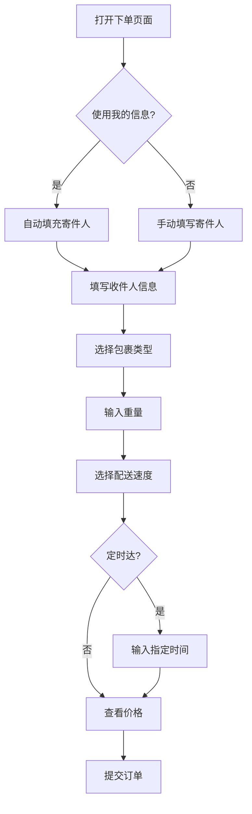

# 📦 客户端下单功能完整指南

## 功能概述

客户端App的"立即下单"功能提供了完整的快递下单流程，与Web端数据完全同步。

---

## ✨ 核心功能

### 1. **寄件人信息** 📤

#### 自动填充我的信息
- ✅ 切换开关自动填充用户姓名和电话
- ✅ 从AsyncStorage读取登录用户信息
- ✅ 可手动修改或关闭自动填充

#### 地址定位
- ✅ 点击"使用当前位置"按钮
- ✅ 请求位置权限
- ✅ 获取GPS坐标
- ✅ 反向地理编码转换为地址
- ✅ 自动填充到寄件地址

**字段：**
- 寄件人姓名 *
- 寄件人电话 *
- 取件地址 * (支持多行输入)

---

### 2. **收件人信息** 📥

**字段：**
- 收件人姓名 *
- 收件人电话 *
- 送达地址 * (支持多行输入)

---

### 3. **包裹信息** 📋

#### 包裹类型（单选）
- 📄 文件
- 🍔 食品
- 👔 衣物
- 📱 电子产品
- 📦 其他

#### 其他信息
- 重量 * (kg，数字输入)
- 物品描述 (选填，多行文本)

---

### 4. **配送选项** 🚚

#### 配送速度（单选，影响价格）

| 选项 | 时效 | 额外费用 |
|------|------|---------|
| 准时达 | 1小时内送达 | ¥0 |
| 急送达 | 30分钟内送达 | +¥10 |
| 定时达 | 指定时间送达 | +¥5 |

#### 定时达选项
- 如果选择"定时达"，显示时间输入框
- 必填项：指定送达时间

---

### 5. **价格计算** 💰

#### 计算公式

```typescript
总价 = 起步价 + 距离费 + 重量费 + 时效费

起步价: ¥5
距离费: ¥2/公里
重量费: ¥1/公斤
时效费: 
  - 准时达: ¥0
  - 急送达: +¥10
  - 定时达: +¥5
```

#### 实时价格显示

价格卡片显示详细费用明细：
```
配送距离: ~8 公里
起步价: ¥5
里程费: ¥16
重量费: ¥2
时效费: ¥10
───────────────
总计: ¥33
```

#### 距离估算

**当前实现：**
- 简化版：随机2-12公里
- 当寄件和收件地址都填写后触发

**未来优化：**
- 集成Google Maps API或高德地图API
- 根据实际地址计算精确距离
- 考虑路况和最优路线

---

## 🔄 完整下单流程

### 步骤1: 填写表单



### 步骤2: 验证表单

验证规则：
- ✅ 寄件人姓名不能为空
- ✅ 寄件人电话不能为空
- ✅ 寄件地址不能为空
- ✅ 收件人姓名不能为空
- ✅ 收件人电话不能为空
- ✅ 收件地址不能为空
- ✅ 包裹类型必须选择
- ✅ 重量必须填写
- ✅ 定时达必须填写时间

### 步骤3: 生成订单数据

```typescript
{
  id: "PKG1736850123456",           // 自动生成
  customer_id: "USR12345678",        // 当前用户ID
  sender_name: "张三",
  sender_phone: "09123456789",
  sender_address: "曼德勒市中心",
  receiver_name: "李四",
  receiver_phone: "09987654321",
  receiver_address: "仰光市区",
  package_type: "食品",
  weight: "2",
  description: "生鲜水果",
  delivery_speed: "急送达",
  scheduled_delivery_time: "",
  delivery_distance: 8,
  status: "待取件",
  create_time: "2025/01/14 15:30:45",
  pickup_time: "",
  delivery_time: "",
  courier: "待分配",
  price: "33.00"
}
```

### 步骤4: 保存到Supabase

```typescript
// 调用packageService创建订单
const result = await packageService.createPackage(orderData);

if (result.success) {
  // 同时更新用户订单统计
  await supabase
    .from('users')
    .update({
      total_orders: total_orders + 1,
      total_spent: total_spent + price
    })
    .eq('id', customer_id);
}
```

### 步骤5: 显示结果

**成功提示：**
```
✅ 订单创建成功！

订单号：PKG1736850123456
总金额：¥33

[查看订单] [继续下单]
```

**失败提示：**
```
❌ 订单创建失败

错误信息：[具体错误]

[重试]
```

---

## 💾 数据存储

### Supabase `packages` 表

| 字段 | 类型 | 说明 | 来源 |
|------|------|------|------|
| id | string | 订单ID | 自动生成 PKG+时间戳 |
| customer_id | string | 客户ID | AsyncStorage |
| sender_name | string | 寄件人姓名 | 表单输入 |
| sender_phone | string | 寄件人电话 | 表单输入 |
| sender_address | string | 取件地址 | 表单输入/GPS |
| receiver_name | string | 收件人姓名 | 表单输入 |
| receiver_phone | string | 收件人电话 | 表单输入 |
| receiver_address | string | 送达地址 | 表单输入 |
| package_type | string | 包裹类型 | 表单选择 |
| weight | string | 重量 | 表单输入 |
| description | string | 物品描述 | 表单输入 |
| delivery_speed | string | 配送速度 | 表单选择 |
| scheduled_delivery_time | string | 指定时间 | 表单输入 |
| delivery_distance | number | 配送距离 | 自动计算 |
| status | string | 订单状态 | 默认"待取件" |
| create_time | string | 创建时间 | 自动生成 |
| pickup_time | string | 取件时间 | 待更新 |
| delivery_time | string | 送达时间 | 待更新 |
| courier | string | 快递员 | 默认"待分配" |
| price | string | 价格 | 自动计算 |
| created_at | timestamp | 创建时间戳 | 数据库自动 |
| updated_at | timestamp | 更新时间戳 | 数据库自动 |

---

## 🎨 UI/UX 设计

### 视觉特点

#### 1. **渐变背景Header**
```typescript
colors: ['#b0d3e8', '#7895a3']
```
- 与Web端品牌色一致
- 显示页面标题和副标题

#### 2. **卡片式分组**
每个信息区块独立卡片：
- 白色背景 `#ffffff`
- 圆角 `16px`
- 阴影效果
- 清晰的视觉分隔

#### 3. **图标增强**
每个分区标题配图标：
- 📦 寄件人信息
- 📮 收件人信息
- 📋 包裹信息
- 🚚 配送选项
- 💰 价格估算

#### 4. **交互元素**

**开关按钮：**
- iOS风格Switch
- 蓝色激活状态

**选项卡片（包裹类型）：**
- 未选中：浅灰背景
- 选中：蓝色背景 + 蓝色边框

**单选按钮（配送速度）：**
- 圆形单选框
- 选中显示内圈圆点
- 额外费用橙色高亮

**提交按钮：**
- 蓝色渐变背景
- 大圆角 `16px`
- 左侧显示"提交订单"
- 右侧显示总价格
- 带阴影和发光效果

---

## 🌍 多语言支持

### 支持语言

- 🇨🇳 中文（简体）
- 🇬🇧 English
- 🇲🇲 မြန်မာ (缅甸语)

### 翻译覆盖

所有UI文本都支持三语切换：
- 标题、副标题
- 表单标签
- 按钮文字
- 提示信息
- 包裹类型
- 配送选项
- 价格标签

---

## 📱 响应式设计

### 适配特性

1. **KeyboardAvoidingView**
   - iOS使用padding模式
   - Android使用height模式
   - 输入时自动避开键盘

2. **ScrollView**
   - 长表单可滚动
   - 隐藏滚动条
   - 平滑滚动体验

3. **文本输入**
   - 自适应键盘类型：
     - 电话：`phone-pad`
     - 重量：`decimal-pad`
     - 普通文本：`default`

4. **多行输入**
   - 地址字段支持多行
   - 物品描述支持多行
   - 自动扩展高度

---

## 🔗 与Web端集成

### 数据同步

| 功能 | Web端 | 客户端App | 同步状态 |
|------|-------|----------|---------|
| 用户账号 | users表 | users表 | ✅ 同步 |
| 订单数据 | packages表 | packages表 | ✅ 同步 |
| 订单字段 | 完整字段 | 完整字段 | ✅ 一致 |
| 价格计算 | 后台计算 | 前端计算 | ⚠️ 需统一 |
| 订单状态 | 多状态流转 | 初始"待取件" | ✅ 同步 |

### 订单状态流转

```
客户端创建 → 待取件 → (Web端管理)
                ↓
              已取件
                ↓
              配送中
                ↓
              已送达
```

### Web端可见性

**在Web端"包裹管理"中：**
- ✅ 可以看到客户端创建的所有订单
- ✅ 可以分配快递员
- ✅ 可以更新订单状态
- ✅ 可以查看详细信息
- ✅ 可以生成二维码

**在Web端"用户管理"中：**
- ✅ 用户的total_orders自动增加
- ✅ 用户的total_spent自动累加

---

## 🚀 使用示例

### 场景1：常规下单

```
1. 用户：张三 (已登录)
2. 打开"立即下单"
3. 自动填充：张三, 09123456789
4. 点击"使用当前位置" → 自动获取地址
5. 填写收件人：李四, 09987654321, 仰光市区
6. 选择包裹类型：食品
7. 输入重量：2kg
8. 选择配送速度：急送达
9. 查看价格：¥33
10. 点击"提交订单"
11. 显示成功：PKG1736850123456
12. 选择"查看订单" → 跳转订单列表
```

### 场景2：定时送达

```
1. 用户填写基本信息
2. 选择配送速度：定时达
3. 输入指定时间：今天18:00
4. 价格增加¥5时效费
5. 提交订单成功
6. 订单包含scheduled_delivery_time字段
```

### 场景3：手动填写

```
1. 关闭"使用我的信息"开关
2. 手动填写不同的寄件人信息
3. 适用于代他人下单场景
4. 其他流程相同
```

---

## ⚠️ 注意事项

### 1. 权限要求

**位置权限：**
```typescript
import * as Location from 'expo-location';

const { status } = await Location.requestForegroundPermissionsAsync();
if (status !== 'granted') {
  Alert.alert('需要位置权限');
  return;
}
```

### 2. 数据验证

**前端验证：**
- 必填字段检查
- 数字格式验证
- 电话号码格式（可选）

**后端验证：**
- Supabase表约束
- 数据类型匹配

### 3. 错误处理

```typescript
try {
  const result = await packageService.createPackage(orderData);
  if (result.success) {
    // 成功处理
  } else {
    // 显示错误信息
    Alert.alert('失败', result.error?.message);
  }
} catch (error) {
  // 异常处理
  Alert.alert('错误', error.message);
}
```

### 4. 性能优化

- ✅ 使用useEffect监听表单变化
- ✅ 防抖输入处理（重量变化）
- ✅ 异步加载位置信息
- ✅ 显示加载动画

---

## 🔮 未来优化

### 短期计划

1. **精确距离计算**
   - 集成地图API
   - 根据实际路线计算

2. **地址选择器**
   - 地图拾取坐标
   - 地址搜索建议
   - 常用地址保存

3. **订单模板**
   - 保存常用收件人
   - 快速填充信息

4. **实时价格**
   - 从服务器获取价格规则
   - 动态调整计费

### 长期计划

1. **支付集成**
   - 在线支付
   - 余额支付
   - 货到付款

2. **优惠券系统**
   - 优惠码输入
   - 自动应用折扣

3. **订单跟踪**
   - 实时位置追踪
   - 送达通知
   - 评价系统

4. **批量下单**
   - 多个包裹一次下单
   - 批量导入Excel

---

## 📊 数据流图

```
┌─────────────┐
│   用户输入   │
└──────┬──────┘
       │
       ▼
┌─────────────┐
│  表单验证    │
└──────┬──────┘
       │
       ▼
┌─────────────┐
│  价格计算    │
└──────┬──────┘
       │
       ▼
┌─────────────┐
│ 生成订单数据 │
└──────┬──────┘
       │
       ▼
┌─────────────┐
│ Supabase API│
└──────┬──────┘
       │
       ├─────┐
       │     ▼
       │  ┌─────────────┐
       │  │ packages表  │
       │  └─────────────┘
       │
       ▼
┌─────────────┐
│ 更新用户统计 │
└──────┬──────┘
       │
       ▼
┌─────────────┐
│  返回结果    │
└──────┬──────┘
       │
       ├─────┐
       │     ▼
       │  ┌─────────────┐
       │  │   成功提示   │
       │  │ + 订单号显示 │
       │  └─────────────┘
       │
       ▼
┌─────────────┐
│ 跳转订单列表 │
└─────────────┘
```

---

## 🎓 开发者指南

### 添加新的包裹类型

```typescript
// 在 packageTypes 数组中添加
const packageTypes = [
  // ... 现有类型
  { value: '新类型', label: currentT.packageTypes.newType },
];

// 在翻译文件中添加
packageTypes: {
  // ... 现有翻译
  newType: '新类型',
}
```

### 修改价格计算逻辑

```typescript
const calculatePrice = () => {
  let basePrice = 5;           // 修改起步价
  let distancePrice = distance * 2;  // 修改里程费率
  let weightPrice = parseFloat(weight || '0') * 1;  // 修改重量费率
  
  // 自定义额外费用
  let speedExtra = deliverySpeed === '急送达' ? 10 : 0;
  
  let total = basePrice + distancePrice + weightPrice + speedExtra;
  setPrice(total.toFixed(2));
};
```

### 集成实际地图API

```typescript
// 使用Google Maps Distance Matrix API
const calculateActualDistance = async (origin, destination) => {
  const response = await fetch(
    `https://maps.googleapis.com/maps/api/distancematrix/json?origins=${origin}&destinations=${destination}&key=YOUR_API_KEY`
  );
  const data = await response.json();
  return data.rows[0].elements[0].distance.value / 1000; // 转换为公里
};
```

---

**创建时间：** 2025-01-14  
**版本：** 1.0.0  
**作者：** MARKET LINK EXPRESS Tech Team  
**状态：** ✅ 生产就绪

